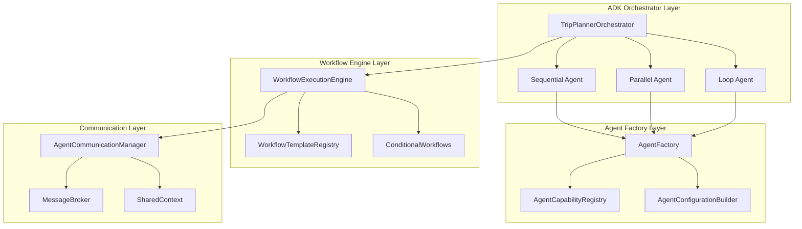
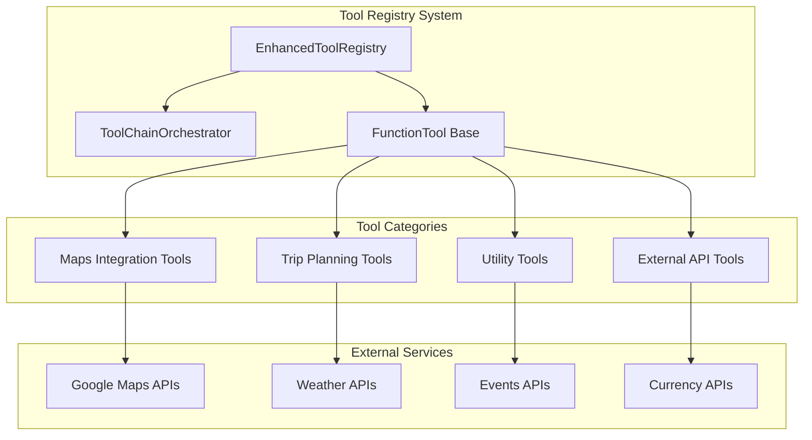
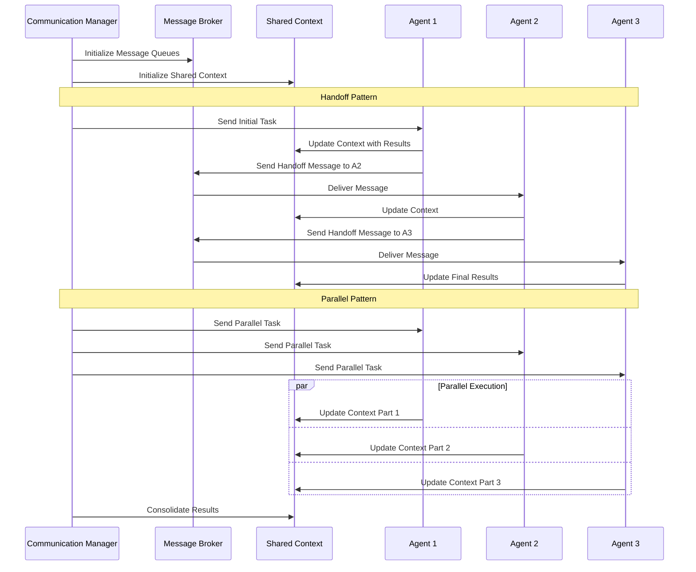

# AI Agents Documentation

> Comprehensive guide to the multi-agent AI system powering intelligent trip planning

## Table of Contents

- [Google ADK Integration](#google-adk-integration)
- [Agent Types and Capabilities](#agent-types-and-capabilities)
- [Multi-Agent Workflow Patterns](#multi-agent-workflow-patterns)
- [Function Tools and External APIs](#function-tools-and-external-apis)
- [Prompt Engineering and Templates](#prompt-engineering-and-templates)
- [Agent Performance Tuning](#agent-performance-tuning)
- [Session Management](#session-management)
- [Agent Communication Patterns](#agent-communication-patterns)
- [Advanced Agent Features](#advanced-agent-features)

---

## Google ADK Integration

The AI-Powered Trip Planner Backend implements Google Agent Development Kit (ADK) patterns for scalable multi-agent coordination. The system uses three core ADK patterns:

### ADK Pattern Implementation

#### Sequential Agent Pattern
Agents execute in a predetermined order, with each agent building upon the previous agent's output.

```python
class SequentialWorkflowAgent(BaseWorkflowAgent):
    """Google ADK SequentialAgent pattern implementation."""
    
    async def execute(self, workflow_definition: WorkflowDefinition, initial_context: Dict[str, Any]):
        execution = WorkflowExecution(
            workflow_id=workflow_definition.workflow_id,
            state=WorkflowState.RUNNING,
            context=initial_context.copy()
        )
        
        for step in workflow_definition.steps:
            # Check dependencies
            if not self._check_dependencies(step, execution.completed_steps):
                if step.required:
                    raise AgentError(f"Dependencies not met for step {step.step_id}")
                continue
            
            # Execute step with timeout
            step_results = await self._execute_step(step, execution.context)
            
            # Process results and update context
            for result in step_results:
                execution.agent_results[result.agent_id] = result
                if isinstance(result.result, dict):
                    execution.context.update(result.result)
            
            execution.completed_steps.append(step.step_id)
        
        return execution
```

#### Parallel Agent Pattern
Multiple agents execute simultaneously for independent tasks, improving performance and efficiency.

```python
class ParallelWorkflowAgent(BaseWorkflowAgent):
    """Google ADK ParallelAgent pattern implementation."""
    
    async def execute(self, workflow_definition: WorkflowDefinition, initial_context: Dict[str, Any]):
        # Execute all steps in parallel
        tasks = []
        for step in workflow_definition.steps:
            task = asyncio.create_task(
                self._execute_step_with_timeout(step, initial_context)
            )
            tasks.append((step, task))
        
        # Wait for all tasks to complete
        for step, task in tasks:
            step_results = await task
            # Process results and merge contexts
            self._merge_parallel_results(step_results, execution)
        
        return execution
```

#### Loop Agent Pattern
Iterative agent execution for continuous improvement and refinement.

```python
class LoopWorkflowAgent(BaseWorkflowAgent):
    """Google ADK LoopAgent pattern implementation."""
    
    async def execute(self, workflow_definition: WorkflowDefinition, initial_context: Dict[str, Any]):
        while execution.iteration_count < workflow_definition.max_iterations:
            execution.iteration_count += 1
            
            # Execute all steps in sequence for this iteration
            for step in workflow_definition.steps:
                step_results = await self._execute_step(step, execution.context)
                # Update context with iterative improvements
                
            # Check success criteria
            if self._check_success_criteria(workflow_definition.success_criteria, execution.context):
                break
        
        return execution
```

### ADK Orchestrator Architecture

### Context-Aware Orchestrator Enhancements

Recent changes introduce deterministic context enrichment without deviating from the
ADK patterns above:

- After each successful **Destination Expert** step, the orchestrator records
  structured points-of-interest by calling the `find_places` tool.
- The **Budget Advisor** stage now relies on the enhanced `calculate_trip_budget`
  tool, transforming Maps price levels into actionable cost breakdowns.
- When the **Trip Planner** stage completes, the orchestrator assembles the
  itinerary (daily plans, weather, local events) and raises the
  `trip_plan_created` flag expected by downstream services.
- **Optimizer** steps can refine the itinerary using the tool chain, ensuring
  the shared context always contains an optimized representation before the
  workflow concludes.

These responsibilities allow the FastAPI layer to persist complete itineraries
even when agent outputs are terse, and they align the implementation with the
"workflow enrichment" called out in the original design brief.



---

## Agent Types and Capabilities

### Core Planning Agents

#### 1. Trip Planner Agent
**Primary coordinator for comprehensive trip planning**

```python
capabilities = AgentCapabilities(
    role=AgentRole.TRIP_PLANNER,
    prompt_type=PromptType.TRIP_PLANNER,
    supported_functions=[
        "find_places",
        "get_directions", 
        "get_travel_time",
        "convert_currency"
    ],
    can_delegate=True,
    max_iterations=15,
    requires_context=["destination", "travel_dates"],
    output_format="structured_itinerary"
)
```

**Capabilities:**
- Comprehensive itinerary creation
- Activity scheduling and coordination
- Budget allocation and optimization
- Transportation planning
- Multi-day trip coordination

**Function Tools:**
- **find_places**: Search for attractions and venues
- **get_directions**: Route planning between locations
- **get_travel_time**: Calculate journey durations
- **convert_currency**: Handle international budgets

#### 2. Destination Expert Agent
**Local knowledge and cultural insights specialist**

```python
capabilities = AgentCapabilities(
    role=AgentRole.DESTINATION_EXPERT,
    prompt_type=PromptType.DESTINATION_EXPERT,
    supported_functions=[
        "find_places",
        "find_nearby_places", 
        "get_place_details"
    ],
    requires_context=["destination"],
    output_format="expert_insights"
)
```

**Specializations:**
- Local culture and traditions
- Historical significance
- Hidden gems and off-the-beaten-path locations
- Seasonal considerations
- Cultural etiquette and customs

#### 3. Budget Advisor Agent
**Financial planning and cost optimization expert**

```python
capabilities = AgentCapabilities(
    role=AgentRole.BUDGET_ADVISOR,
    prompt_type=PromptType.BUDGET_ADVISOR,
    supported_functions=[
        "convert_currency",
        "find_places"  # For price research
    ],
    requires_context=["budget", "destination", "activities"],
    output_format="budget_analysis"
)
```

**Capabilities:**
- Detailed cost breakdowns
- Budget optimization strategies
- Currency conversion and payment advice
- Value-for-money recommendations
- Emergency fund planning

### Specialized Support Agents

#### 4. Information Gatherer Agent
**Parallel data collection and research specialist**

```python
capabilities = AgentCapabilities(
    role=AgentRole.INFORMATION_GATHERER,
    prompt_type=PromptType.DESTINATION_EXPERT,
    supported_functions=[
        "find_places",
        "geocode_location",
        "find_nearby_places",
        "get_place_details",
        "validate_location"
    ],
    specializations=[
        "destination_research",
        "activity_discovery", 
        "venue_analysis"
    ],
    output_format="structured_data"
)
```

#### 5. Itinerary Planner Agent
**Daily scheduling and timeline optimization**

```python
capabilities = AgentCapabilities(
    role=AgentRole.ITINERARY_PLANNER,
    prompt_type=PromptType.TRIP_PLANNER,
    supported_functions=[
        "find_places",
        "get_directions",
        "get_travel_time",
        "get_place_details"
    ],
    specializations=[
        "daily_scheduling",
        "route_optimization",
        "timing_coordination"
    ],
    output_format="daily_itinerary"
)
```

#### 6. Optimization Agent
**Multi-criteria optimization and efficiency expert**

```python
capabilities = AgentCapabilities(
    role=AgentRole.OPTIMIZATION_AGENT,
    prompt_type=PromptType.ITINERARY_OPTIMIZER,
    supported_functions=[
        "get_travel_time",
        "get_directions", 
        "convert_currency"
    ],
    specializations=[
        "cost_optimization",
        "time_optimization",
        "route_optimization"
    ],
    output_format="optimized_plan"
)
```

### Agent Creation and Configuration

#### Dynamic Agent Factory

```python
class TripPlanningAgentFactory:
    """Factory for creating specialized agents based on trip requirements."""
    
    def create_agent_for_trip(
        self,
        trip_requirements: TripRequirements,
        agent_role: AgentRole,
        session_id: Optional[str] = None
    ) -> GeminiAgent:
        # Determine configuration based on trip complexity
        config = self._build_config_for_trip(agent_role, trip_requirements)
        
        # Create specialized agent
        agent = self._create_specialized_agent(
            agent_role, trip_requirements, config, session_id
        )
        
        return agent
    
    def create_agent_team_for_trip(
        self,
        trip_requirements: TripRequirements,
        session_id: Optional[str] = None
    ) -> Dict[AgentRole, GeminiAgent]:
        """Create complete agent team based on trip complexity."""
        
        if trip_requirements.complexity == TripComplexity.SIMPLE:
            required_roles = [AgentRole.TRIP_PLANNER, AgentRole.BUDGET_ADVISOR]
        elif trip_requirements.complexity == TripComplexity.COMPLEX:
            required_roles = [
                AgentRole.INFORMATION_GATHERER,
                AgentRole.DESTINATION_EXPERT,
                AgentRole.ITINERARY_PLANNER,
                AgentRole.BUDGET_ADVISOR,
                AgentRole.ROUTE_PLANNER,
                AgentRole.OPTIMIZATION_AGENT
            ]
        
        agent_team = {}
        for role in required_roles:
            agent = self.create_agent_for_trip(trip_requirements, role, session_id)
            agent_team[role] = agent
            
        return agent_team
```

#### Agent Configuration Builder

```python
class AgentConfigurationBuilder:
    """Builder pattern for agent configuration."""
    
    def for_role(self, role: AgentRole) -> "AgentConfigurationBuilder":
        self._config.agent_type = role
        
        # Set defaults from capability registry
        capabilities = self.registry.get_agent_capabilities(role)
        if capabilities:
            self._config.supported_functions = capabilities.get("functions", [])
            self._config.requires_context = capabilities.get("context_requirements", [])
        
        return self
    
    def with_resource_tier(self, tier: ResourceTier) -> "AgentConfigurationBuilder":
        if tier == ResourceTier.PREMIUM:
            self._config.timeout_seconds = 600
            self._config.max_iterations = 20
        elif tier == ResourceTier.ECONOMY:
            self._config.timeout_seconds = 120
            self._config.max_iterations = 5
            
        return self
    
    def build(self) -> AgentConfiguration:
        return self._config
```

---

## Multi-Agent Workflow Patterns

### Workflow Types and Execution Modes

#### Sequential Workflow
**Best for:** Step-by-step planning where each agent builds upon previous results

```python
def create_comprehensive_trip_planning_workflow() -> WorkflowDefinition:
    return WorkflowDefinition(
        name="Comprehensive Trip Planning",
        workflow_type=WorkflowType.SEQUENTIAL,
        steps=[
            WorkflowStep(
                step_id="destination_research",
                agent_roles=[AgentRole.DESTINATION_EXPERT],
                execution_mode=AgentExecutionMode.SEQUENTIAL,
                timeout_seconds=120,
                required=True
            ),
            WorkflowStep(
                step_id="budget_analysis", 
                agent_roles=[AgentRole.BUDGET_ADVISOR],
                dependencies=["destination_research"],
                timeout_seconds=90,
                required=True
            ),
            WorkflowStep(
                step_id="itinerary_creation",
                agent_roles=[AgentRole.TRIP_PLANNER],
                dependencies=["destination_research", "budget_analysis"],
                timeout_seconds=300,
                required=True
            )
        ],
        global_timeout=900  # 15 minutes total
    )
```

#### Parallel Workflow
**Best for:** Independent research tasks that can run simultaneously

```python
def create_quick_trip_planning_workflow() -> WorkflowDefinition:
    return WorkflowDefinition(
        name="Quick Trip Planning",
        workflow_type=WorkflowType.PARALLEL,
        steps=[
            WorkflowStep(
                step_id="parallel_research",
                agent_roles=[
                    AgentRole.DESTINATION_EXPERT,
                    AgentRole.BUDGET_ADVISOR,
                    AgentRole.WEATHER_ANALYST
                ],
                execution_mode=AgentExecutionMode.PARALLEL,
                timeout_seconds=60
            ),
            WorkflowStep(
                step_id="consolidation",
                agent_roles=[AgentRole.TRIP_PLANNER],
                timeout_seconds=120
            )
        ],
        global_timeout=300  # 5 minutes total
    )
```

#### Loop Workflow
**Best for:** Iterative refinement and optimization

```python
def create_optimization_workflow() -> WorkflowDefinition:
    return WorkflowDefinition(
        name="Iterative Trip Optimization",
        workflow_type=WorkflowType.LOOP,
        steps=[
            WorkflowStep(
                step_id="analyze_current_plan",
                agent_roles=[AgentRole.OPTIMIZATION_AGENT],
                timeout_seconds=90
            ),
            WorkflowStep(
                step_id="apply_improvements",
                agent_roles=[AgentRole.ITINERARY_PLANNER],
                timeout_seconds=120
            )
        ],
        max_iterations=5,
        success_criteria={"optimization_score": 0.9}
    )
```

### Workflow Execution Engine

```python
class WorkflowExecutionEngine:
    """Engine for executing multi-agent workflows with state persistence."""
    
    async def execute_workflow(
        self,
        workflow_definition: WorkflowDefinition,
        trip_requirements: TripRequirements,
        priority: WorkflowPriority = WorkflowPriority.NORMAL
    ) -> WorkflowExecution:
        
        # Create agent team for workflow
        agent_team = self.agent_factory.create_agent_team_for_trip(
            trip_requirements, self.session_id
        )
        
        # Initialize orchestrator with agents
        orchestrator = TripPlannerOrchestrator(self.session_id)
        for agent in agent_team.values():
            await orchestrator.register_agent(agent)
        
        # Execute based on workflow type
        if workflow_definition.workflow_type == WorkflowType.SEQUENTIAL:
            execution = await self._execute_sequential_workflow(
                workflow_definition, initial_context, orchestrator
            )
        elif workflow_definition.workflow_type == WorkflowType.PARALLEL:
            execution = await self._execute_parallel_workflow(
                workflow_definition, initial_context, orchestrator
            )
        elif workflow_definition.workflow_type == WorkflowType.LOOP:
            execution = await self._execute_loop_workflow(
                workflow_definition, initial_context, orchestrator
            )
        
        return execution
```

### Conditional Workflows

```python
class WorkflowCondition:
    """Condition for conditional workflow execution."""
    
    def evaluate(self, context: Dict[str, Any]) -> bool:
        if self.operator == ConditionalOperator.AND:
            return all(cond.evaluate(context) for cond in self.sub_conditions)
        elif self.operator == ConditionalOperator.OR:
            return any(cond.evaluate(context) for cond in self.sub_conditions)
        elif self.operator == ConditionalOperator.EQUALS:
            return context.get(self.field_name) == self.expected_value
        elif self.operator == ConditionalOperator.GREATER_THAN:
            return context.get(self.field_name) > self.expected_value
        
        return False

# Example conditional workflow
complex_trip_condition = WorkflowCondition(
    field_name="duration_days",
    operator=ConditionalOperator.GREATER_THAN,
    expected_value=7
)

budget_condition = WorkflowCondition(
    field_name="budget_range",
    operator=ConditionalOperator.EXISTS
)

complex_workflow_template = WorkflowTemplate(
    template_id="complex_trip_planning",
    name="Complex Trip Planning",
    workflow_type=WorkflowType.PARALLEL,
    conditions=[complex_trip_condition, budget_condition]
)
```

---

## Function Tools and External APIs

### Tool Registry Architecture



### Google Maps Integration Tools

#### Places Search Tool
```python
@tool_function(
    name="find_places",
    description="Search for places using Google Places API",
    category=ToolCategory.MAPS,
    parameters=[
        ToolParameter(
            name="query",
            type_hint=str,
            description="Search query for places",
            required=True,
            example="restaurants in Kochi"
        ),
        ToolParameter(
            name="location",
            type_hint=str,
            description="Location bias as lat,lng",
            required=False,
            example="9.9312,76.2673"
        ),
        ToolParameter(
            name="radius",
            type_hint=int,
            description="Search radius in meters",
            required=False,
            default=5000,
            example=10000
        )
    ]
)
async def find_places(query: str, location: str = None, radius: int = 5000):
    places_service = get_places_service()
    
    location_obj = None
    if location:
        lat, lng = map(float, location.split(','))
        location_obj = GeoLocation(lat=lat, lng=lng)
    
    result = await places_service.search_text(
        query=query,
        location=location_obj,
        radius=radius
    )
    
    return {
        "places": [place.model_dump() for place in result.results],
        "search_metadata": {
            "query": query,
            "location": location,
            "results_count": len(result.results)
        }
    }
```

#### Directions Tool
```python
@tool_function(
    name="get_directions",
    description="Get directions between locations",
    category=ToolCategory.MAPS
)
async def get_directions(
    origin: str,
    destination: str,
    mode: str = "driving",
    waypoints: List[str] = None,
    optimize_waypoints: bool = False
):
    directions_service = get_directions_service()
    
    request = DirectionsRequest(
        origin=origin,
        destination=destination,
        mode=TravelMode(mode),
        waypoints=waypoints,
        optimize_waypoints=optimize_waypoints
    )
    
    result = await directions_service.get_directions(request)
    
    return {
        "routes": [route.model_dump() for route in result.routes],
        "status": result.status,
        "request_metadata": {
            "origin": origin,
            "destination": destination,
            "mode": mode,
            "optimization_applied": optimize_waypoints
        }
    }
```

### Trip Planning Tools

#### Budget Calculator Tool
```python
class BudgetCalculatorTool(EnhancedFunctionTool):
    async def execute(self, **kwargs) -> Dict[str, Any]:
        validated_params = self.validate_parameters(kwargs)
        
        destination = validated_params["destination"]
        duration_days = validated_params["duration_days"]
        traveler_count = validated_params.get("traveler_count", 1)
        accommodation_level = validated_params.get("accommodation_level", "mid-range")
        
        # Calculate budget based on destination and preferences
        budget_breakdown = await self._calculate_budget(
            destination, duration_days, traveler_count, accommodation_level
        )
        
        return budget_breakdown
```

#### Itinerary Optimizer Tool
```python
class ItineraryOptimizerTool(EnhancedFunctionTool):
    async def execute(self, **kwargs) -> Dict[str, Any]:
        itinerary_data = kwargs["itinerary_data"]
        optimization_criteria = kwargs.get("optimization_criteria", ["time", "cost"])
        
        # Apply optimization algorithms
        optimizations = {
            "time_optimizations": [
                "Group nearby attractions by location",
                "Optimize travel routes to minimize commute time",
                "Schedule activities during optimal hours"
            ],
            "cost_optimizations": [
                "Combine tickets for group discounts",
                "Use public transport where efficient",
                "Schedule free activities and walking tours"
            ],
            "experience_optimizations": [
                "Balance different activity types",
                "Include authentic local experiences",
                "Add buffer time for spontaneous discoveries"
            ]
        }
        
        return {
            "optimized_itinerary": {
                "optimization_applied": True,
                "criteria_used": optimization_criteria,
                "recommendations": self._get_optimization_recommendations(optimization_criteria)
            },
            "optimization_score": self._calculate_optimization_score(itinerary_data),
            "estimated_improvements": {
                "time_saved": "2-3 hours per day",
                "cost_reduction": "15-25%",
                "experience_enhancement": "Significant"
            }
        }
```

### Tool Chain Orchestration

```python
class ToolChainOrchestrator:
    """Orchestrator for chaining multiple tools together."""
    
    async def execute_tool_chain(
        self,
        chain_definition: List[Dict[str, Any]],
        initial_context: Optional[Dict[str, Any]] = None
    ) -> Dict[str, Any]:
        
        context = initial_context or {}
        chain_results = {
            "chain_id": str(uuid4())[:8],
            "start_time": datetime.now(timezone.utc).isoformat(),
            "steps": [],
            "success": True
        }
        
        for i, step in enumerate(chain_definition):
            tool_name = step["tool"]
            parameters = step.get("parameters", {})
            context_mapping = step.get("context_mapping", {})
            
            # Apply context mapping
            for param_key, context_key in context_mapping.items():
                if context_key in context:
                    parameters[param_key] = context[context_key]
            
            # Execute tool
            try:
                result = await self.tool_registry.execute_tool(tool_name, parameters)
                
                # Update context with results
                if isinstance(result.get("result"), dict):
                    context.update(result["result"])
                
                chain_results["steps"].append({
                    "step_index": i,
                    "tool_name": tool_name,
                    "success": True,
                    "result": result
                })
                
            except Exception as e:
                chain_results["steps"].append({
                    "step_index": i,
                    "tool_name": tool_name,
                    "success": False,
                    "error": str(e)
                })
                
                if step.get("critical", True):
                    chain_results["success"] = False
                    break
        
        return chain_results

# Example tool chain for comprehensive trip planning
comprehensive_planning_chain = [
    {
        "tool": "calculate_trip_budget",
        "parameters": {
            "destination": "{destination}",
            "duration_days": "{duration_days}"
        },
        "context_mapping": {
            "destination": "destination",
            "duration_days": "duration_days"
        },
        "critical": True
    },
    {
        "tool": "get_weather_info",
        "parameters": {"location": "{destination}"},
        "context_mapping": {"location": "destination"},
        "critical": False
    },
    {
        "tool": "find_places",
        "parameters": {"query": "tourist attractions in {destination}"},
        "context_mapping": {"query": "attractions_query"},
        "critical": True
    },
    {
        "tool": "optimize_itinerary",
        "parameters": {"optimization_criteria": ["time", "cost", "experience"]},
        "context_mapping": {"itinerary_data": "places"},
        "critical": False
    }
]
```

### Enhanced Tool Analytics

```python
class EnhancedFunctionTool(FunctionTool):
    """Enhanced function tool with analytics and caching."""
    
    def __init__(self, metadata: ToolMetadata):
        super().__init__(metadata)
        self._execution_history: List[Dict[str, Any]] = []
        self._performance_stats = {
            "avg_execution_time": 0.0,
            "success_rate": 100.0,
            "total_executions": 0,
            "cache_hits": 0,
            "error_patterns": {}
        }
        self._result_cache: Dict[str, Tuple[Any, datetime]] = {}
    
    async def execute_with_analytics(self, **kwargs) -> Dict[str, Any]:
        execution_start = datetime.now(timezone.utc)
        execution_id = str(uuid4())[:8]
        
        # Check cache first
        cache_key = self._generate_cache_key(kwargs)
        cached_result = self._get_cached_result(cache_key)
        
        if cached_result and self.metadata.cacheable:
            self._performance_stats["cache_hits"] += 1
            return {
                "tool_name": self.metadata.name,
                "result": cached_result,
                "execution_time": 0.001,
                "cache_hit": True,
                "execution_id": execution_id
            }
        
        # Execute tool
        try:
            result = await self.execute(**kwargs)
            execution_time = (datetime.now(timezone.utc) - execution_start).total_seconds()
            
            # Cache result if cacheable
            if self.metadata.cacheable:
                self._cache_result(cache_key, result)
            
            # Update analytics
            self._update_performance_stats(execution_time, True)
            
            return {
                "tool_name": self.metadata.name,
                "result": result,
                "execution_time": execution_time,
                "cache_hit": False,
                "execution_id": execution_id
            }
            
        except Exception as e:
            execution_time = (datetime.now(timezone.utc) - execution_start).total_seconds()
            self._update_performance_stats(execution_time, False)
            raise e
```

---

## Prompt Engineering and Templates

### Multi-Language Prompt System

#### Template Structure
```python
class PromptTemplate:
    """Prompt template with parameter injection."""
    
    def __init__(
        self,
        template: str,
        prompt_type: PromptType,
        language: LanguageCode = LanguageCode.ENGLISH,
        required_params: List[str] = None,
        optional_params: List[str] = None
    ):
        self.template = template
        self.prompt_type = prompt_type
        self.language = language
        self.required_params = required_params or []
        self.optional_params = optional_params or []
    
    def render(self, **kwargs) -> str:
        # Validate required parameters
        missing_params = [p for p in self.required_params if p not in kwargs]
        if missing_params:
            raise PromptTemplateError(f"Missing required parameters: {missing_params}")
        
        # Add common defaults
        render_params = kwargs.copy()
        render_params.setdefault("current_date", datetime.now().strftime("%Y-%m-%d"))
        render_params.setdefault("language", self.language.value)
        
        return self.template.format(**render_params)
```

#### Context-Aware Prompt Generation

```python
def get_context_aware_prompt(
    prompt_type: PromptType,
    user_context: Dict[str, Any],
    trip_context: Dict[str, Any],
    **additional_params
) -> str:
    """Generate context-aware prompt based on user and trip information."""
    
    # Determine user's preferred language
    user_language = user_context.get("language", "en")
    language = LanguageCode(user_language) if user_language in [l.value for l in LanguageCode] else LanguageCode.ENGLISH
    
    # Combine all context parameters
    context_params = {**user_context, **trip_context, **additional_params}
    
    # Add defaults
    context_params.setdefault("currency", settings.default_budget_currency)
    context_params.setdefault("user_location", settings.default_country)
    
    return render_system_prompt(prompt_type, language, **context_params)
```

### Specialized Prompt Templates

#### Trip Planner Prompt (English)
```python
trip_planner_template = """You are an expert AI Trip Planner Assistant for a comprehensive travel planning platform.

CORE CAPABILITIES:
- Create detailed day-by-day itineraries with specific activities, times, and locations
- Provide budget estimates and cost breakdowns
- Suggest accommodations, restaurants, and transportation options
- Offer local insights and cultural recommendations
- Adapt plans based on user preferences, interests, and constraints

USER CONTEXT:
- Date: {current_date}
- User Location: {user_location}
- Preferred Language: {language}
- Budget Range: {budget_range}
- Travel Style: {travel_style}
- Interests: {interests}

TRIP DETAILS:
- Destination: {destination}
- Travel Dates: {start_date} to {end_date}
- Duration: {duration_days} days
- Group Size: {group_size}
- Age Group: {age_group}

REQUIREMENTS:
1. Always provide specific, actionable recommendations with addresses and timing
2. Include budget estimates in {currency}
3. Consider local weather and seasonal factors
4. Suggest authentic local experiences
5. Provide backup options for weather or other contingencies

RESPONSE FORMAT:
- Start with a brief welcome and trip overview
- Provide day-by-day detailed itinerary
- Include estimated costs and budget breakdown
- End with practical travel tips specific to the destination"""
```

#### Destination Expert Prompt
```python
destination_expert_template = """You are a Destination Expert specializing in {destination}. You have deep local knowledge about culture, history, hidden gems, and authentic experiences.

EXPERTISE AREAS:
- Local culture and traditions
- Historical significance and landmarks
- Best times to visit different attractions
- Hidden gems and off-the-beaten-path locations
- Local cuisine and dining recommendations
- Cultural etiquette and customs
- Shopping and local markets
- Seasonal considerations and weather patterns

CURRENT CONTEXT:
- Destination: {destination}
- Season/Month: {travel_month}
- Traveler Type: {traveler_type}
- Duration: {duration_days} days

Focus on providing authentic, insider knowledge that only a local expert would know."""
```

#### Budget Advisor Prompt
```python
budget_advisor_template = """You are a Travel Budget Advisor specializing in cost optimization and financial planning for trips.

EXPERTISE:
- Detailed cost breakdowns for all travel expenses
- Budget optimization strategies
- Money-saving tips and alternatives
- Currency exchange and payment methods
- Seasonal price variations
- Value-for-money recommendations

BUDGET CONTEXT:
- Total Budget: {total_budget} {currency}
- Budget Category: {budget_category}
- Duration: {duration_days} days
- Group Size: {group_size}
- Destination: {destination}

COST CATEGORIES TO CONSIDER:
- Accommodation (budget/mid-range/luxury options)
- Transportation (flights, local transport, taxis)
- Food and dining (street food to fine dining)
- Activities and attractions
- Shopping and souvenirs
- Emergency fund (10-15% of total budget)"""
```

### Multi-Language Support

```python
class PromptTemplateManager:
    """Manager for prompt templates with multi-language support."""
    
    def __init__(self):
        self._templates: Dict[Tuple[PromptType, LanguageCode], PromptTemplate] = {}
        self._initialize_templates()
    
    def get_template(
        self, 
        prompt_type: PromptType, 
        language: LanguageCode = LanguageCode.ENGLISH
    ) -> PromptTemplate:
        key = (prompt_type, language)
        
        if key not in self._templates:
            # Fallback to English if requested language not available
            fallback_key = (prompt_type, LanguageCode.ENGLISH)
            if fallback_key in self._templates:
                logger.warning(f"Template not found for {language}, using English fallback")
                return self._templates[fallback_key]
            
            raise PromptTemplateError(f"Template not found: {prompt_type} in {language}")
        
        return self._templates[key]
    
    def render_prompt(
        self,
        prompt_type: PromptType,
        language: LanguageCode = LanguageCode.ENGLISH,
        **kwargs
    ) -> str:
        template = self.get_template(prompt_type, language)
        return template.render(**kwargs)
```

---

## Agent Communication Patterns

### Communication Architecture



### Message Types and Protocols

#### Inter-Agent Messaging

```python
class AgentMessage:
    """Enhanced message structure for inter-agent communication."""
    
    message_id: str = field(default_factory=lambda: str(uuid4()))
    sender_id: str
    receiver_id: Optional[str] = None
    message_type: MessageType = MessageType.REQUEST
    priority: MessagePriority = MessagePriority.NORMAL
    content: str
    context_data: Dict[str, Any] = field(default_factory=dict)
    timestamp: datetime = field(default_factory=lambda: datetime.now(timezone.utc))
    expires_at: Optional[datetime] = None
    reply_to: Optional[str] = None
    conversation_thread: Optional[str] = None

# Message priority handling
async def _deliver_direct_message(self, message: AgentMessage) -> None:
    receiver_id = message.receiver_id
    
    if receiver_id not in self._message_queues:
        self._message_queues[receiver_id] = []
    
    # Insert based on priority
    if message.priority == MessagePriority.CRITICAL:
        self._message_queues[receiver_id].insert(0, message)
    elif message.priority == MessagePriority.HIGH:
        # Insert after critical messages
        critical_count = sum(
            1 for m in self._message_queues[receiver_id] 
            if m.priority == MessagePriority.CRITICAL
        )
        self._message_queues[receiver_id].insert(critical_count, message)
    else:
        self._message_queues[receiver_id].append(message)
```

### Coordination Patterns

#### Handoff Pattern Implementation
```python
class HandoffPattern(CoordinationPattern):
    """Sequential handoff pattern for agent coordination."""
    
    async def execute_pattern(
        self, agents: List[str], initial_context: Dict[str, Any]
    ) -> Dict[str, Any]:
        current_result = initial_context
        
        for i, agent_id in enumerate(agents):
            # Prepare handoff message
            handoff_content = json.dumps({
                "handoff_index": i,
                "previous_agent": agents[i-1] if i > 0 else None,
                "next_agent": agents[i+1] if i < len(agents)-1 else None,
                "current_context": current_result,
                "handoff_instructions": "Process context and prepare for next agent"
            })
            
            # Send handoff message
            message_id = await self.message_broker.send_message(
                sender_id="handoff_coordinator",
                receiver_id=agent_id,
                content=handoff_content,
                message_type=MessageType.HANDOFF,
                priority=MessagePriority.HIGH,
                context_data=current_result
            )
            
            # Update shared context
            await self.shared_context.update_context(agent_id, {
                f"handoff_{i}_result": current_result,
                "current_handoff_agent": agent_id
            })
        
        return {"handoff_chain": handoff_records, "final_result": current_result}
```

#### Collaboration Pattern Implementation
```python
class CollaborationPattern(CoordinationPattern):
    """Peer-to-peer collaboration pattern."""
    
    async def execute_pattern(
        self, agents: List[str], initial_context: Dict[str, Any]
    ) -> Dict[str, Any]:
        # Create collaboration thread
        thread_id = str(uuid4())[:8]
        
        # Send collaboration invitation to all agents
        collaboration_content = json.dumps({
            "collaboration_type": "peer_to_peer",
            "participating_agents": agents,
            "shared_objective": "Collaborative trip planning",
            "initial_context": initial_context,
            "thread_id": thread_id
        })
        
        # Send to all agents simultaneously
        message_ids = []
        for agent_id in agents:
            message_id = await self.message_broker.send_message(
                sender_id="collaboration_coordinator",
                receiver_id=agent_id,
                content=collaboration_content,
                message_type=MessageType.COLLABORATION,
                priority=MessagePriority.HIGH,
                context_data=initial_context
            )
            message_ids.append(message_id)
        
        # Simulate consensus building process
        consensus_data = {
            "collaborative_result": "Peer agents contributed to comprehensive plan",
            "agent_contributions": {
                agent_id: f"Contribution from {agent_id}" for agent_id in agents
            },
            "consensus_reached": True,
            "confidence_score": 8.5
        }
        
        return {"consensus": consensus_data, "thread_id": thread_id}
```

### Shared Context Management

```python
class SharedContext:
    """Shared context manager for multi-agent collaboration."""
    
    async def update_context(self, agent_id: str, updates: Dict[str, Any]) -> None:
        """Thread-safe context updates."""
        async with self._context_lock:
            # Record change
            change_record = {
                "agent_id": agent_id,
                "timestamp": datetime.now(timezone.utc).isoformat(),
                "updates": updates,
                "previous_keys": list(self._context_data.keys())
            }
            
            # Apply updates
            self._context_data.update(updates)
            self._change_log.append(change_record)
            
            # Persist to session
            await self._persist_context()
            
            # Notify subscribers
            await self._notify_subscribers("context_updated", {
                "agent_id": agent_id,
                "updated_keys": list(updates.keys()),
                "context_snapshot": self._context_data.copy()
            })
    
    async def subscribe_to_changes(self, agent_id: str, callback: Callable) -> None:
        """Subscribe to context changes."""
        if agent_id not in self._subscribers:
            self._subscribers[agent_id] = []
        self._subscribers[agent_id].append(callback)
    
    async def get_context(self, keys: Optional[List[str]] = None) -> Dict[str, Any]:
        """Get shared context data."""
        async with self._context_lock:
            if keys:
                return {k: self._context_data.get(k) for k in keys if k in self._context_data}
            return self._context_data.copy()
```

---

## Session Management

### AI Session Architecture

```python
class AISession(BaseModel):
    """AI conversation session with context persistence."""
    
    session_id: str = Field(default_factory=lambda: str(uuid4()))
    user_id: str
    status: SessionStatus = SessionStatus.ACTIVE
    
    # Timestamps
    created_at: datetime = Field(default_factory=lambda: datetime.now(timezone.utc))
    updated_at: datetime = Field(default_factory=lambda: datetime.now(timezone.utc))
    last_activity: datetime = Field(default_factory=lambda: datetime.now(timezone.utc))
    expires_at: datetime = Field(default_factory=lambda: datetime.now(timezone.utc) + timedelta(hours=24))
    
    # Conversation data
    messages: List[ConversationMessage] = Field(default_factory=list)
    context: SessionContext
    
    # Session statistics
    total_tokens: int = 0
    message_count: int = 0
    function_calls_count: int = 0
    
    def add_message(self, message: ConversationMessage) -> None:
        """Add message to conversation with automatic statistics updates."""
        self.messages.append(message)
        self.message_count += 1
        self.last_activity = datetime.now(timezone.utc)
        
        if message.token_count:
            self.total_tokens += message.token_count
        
        if message.function_call:
            self.function_calls_count += 1
        
        # Trim messages if exceeding limit
        if len(self.messages) > self.max_messages:
            self._trim_messages()
    
    def _trim_messages(self) -> None:
        """Trim conversation history while preserving important messages."""
        system_messages = [m for m in self.messages if m.role == MessageRole.SYSTEM]
        recent_messages = [
            m for m in self.messages if m.role != MessageRole.SYSTEM
        ][-self.max_messages + len(system_messages):]
        self.messages = system_messages + recent_messages
```

#### Session Context Structure

```python
class SessionContext(BaseModel):
    """Comprehensive session context information."""
    
    user_id: str
    user_profile: Dict[str, Any] = Field(default_factory=dict)
    trip_context: Dict[str, Any] = Field(default_factory=dict)
    preferences: Dict[str, Any] = Field(default_factory=dict)
    conversation_summary: str = ""
    active_tools: List[str] = Field(default_factory=list)
    current_task: Optional[str] = None
    session_metadata: Dict[str, Any] = Field(default_factory=dict)

# Example context structure
session_context = {
    "user_profile": {
        "name": "John Doe",
        "location": "Mumbai, India",
        "preferences": {
            "budget_range": "moderate",
            "activities": ["cultural", "nature"],
            "dietary_restrictions": ["vegetarian"]
        }
    },
    "trip_context": {
        "destination": "Kerala, India",
        "duration_days": 7,
        "start_date": "2024-03-15",
        "traveler_count": 2,
        "trip_type": "leisure"
    },
    "active_tools": ["find_places", "get_directions", "convert_currency"],
    "current_task": "comprehensive_trip_planning",
    "session_metadata": {
        "workflow_executions": {},
        "agent_states": {},
        "shared_context": {}
    }
}
```

### Session Lifecycle Management

```python
class SessionManager:
    """AI session manager with Firestore persistence."""
    
    async def create_session(
        self,
        user_id: str,
        initial_context: Optional[Dict[str, Any]] = None,
        **session_options
    ) -> AISession:
        """Create new AI session with context initialization."""
        
        context_data = initial_context or {}
        context = SessionContext(
            user_id=user_id,
            user_profile=context_data.get("user_profile", {}),
            trip_context=context_data.get("trip_context", {}),
            preferences=context_data.get("preferences", {}),
            session_metadata=context_data.get("metadata", {})
        )
        
        session = AISession(user_id=user_id, context=context, **session_options)
        
        # Add system message if provided
        system_prompt = context_data.get("system_prompt")
        if system_prompt:
            system_message = ConversationMessage(
                role=MessageRole.SYSTEM,
                content=system_prompt
            )
            session.add_message(system_message)
        
        # Save to Firestore and cache in memory
        await self._save_session(session)
        self._active_sessions[session.session_id] = session
        
        return session
    
    async def add_message(
        self, 
        session_id: str, 
        role: MessageRole, 
        content: str, 
        **message_metadata
    ) -> ConversationMessage:
        """Add message to session with automatic persistence."""
        
        session = await self.get_session(session_id)
        
        message = ConversationMessage(
            role=role,
            content=content,
            metadata=message_metadata,
            **{k: v for k, v in message_metadata.items() 
               if k in ["token_count", "function_call", "function_response"]}
        )
        
        session.add_message(message)
        await self.update_session(session)
        
        return message
```

---

## Agent Performance Tuning

### Performance Optimization Strategies

#### Agent Pool Management
```python
class AgentPoolManager:
    """Manage pools of agents for efficient resource utilization."""
    
    def __init__(self):
        self.agent_pools = {role: [] for role in AgentRole}
        self.pool_sizes = {
            AgentRole.TRIP_PLANNER: 5,
            AgentRole.DESTINATION_EXPERT: 3,
            AgentRole.BUDGET_ADVISOR: 2,
            AgentRole.OPTIMIZATION_AGENT: 3
        }
        self.usage_stats = {role: 0 for role in AgentRole}
    
    async def get_agent(self, role: AgentRole, session_id: str) -> BaseAgent:
        """Get available agent from pool or create new one."""
        pool = self.agent_pools[role]
        
        # Find available agent
        for agent in pool:
            if agent.state == AgentState.READY:
                self.usage_stats[role] += 1
                return agent
        
        # Create new agent if pool not full
        if len(pool) < self.pool_sizes[role]:
            agent = await self._create_agent(role, session_id)
            pool.append(agent)
            self.usage_stats[role] += 1
            return agent
        
        # Wait for agent to become available
        return await self._wait_for_available_agent(role)
    
    async def _wait_for_available_agent(self, role: AgentRole, timeout: int = 60) -> BaseAgent:
        """Wait for agent to become available with timeout."""
        start_time = datetime.now()
        
        while (datetime.now() - start_time).seconds < timeout:
            for agent in self.agent_pools[role]:
                if agent.state == AgentState.READY:
                    return agent
            await asyncio.sleep(1)
        
        raise AgentError(f"No agent available for role {role} within timeout")
```

#### Token Usage Optimization

```python
class TokenBudgetManager:
    """Manage AI token budgets across agents and sessions."""
    
    def __init__(self):
        self.token_budgets = {
            "user_session": 10000,     # Per user session
            "user_hour": 50000,        # Per user per hour
            "global_hour": 1000000,    # Global rate limit
            "agent_request": 2000      # Per agent request
        }
        self.usage_tracking = {}
    
    async def check_token_budget(
        self, 
        user_id: str, 
        agent_id: str, 
        estimated_tokens: int
    ) -> bool:
        """Check if token usage is within budgets."""
        current_usage = await self.get_usage_stats(user_id)
        
        # Check various budget limits
        if current_usage["session"] + estimated_tokens > self.token_budgets["user_session"]:
            logger.warning("Session token budget exceeded", user_id=user_id)
            return False
        
        if current_usage["hour"] + estimated_tokens > self.token_budgets["user_hour"]:
            logger.warning("Hourly token budget exceeded", user_id=user_id)
            return False
        
        if estimated_tokens > self.token_budgets["agent_request"]:
            logger.warning("Single request token budget exceeded", agent_id=agent_id)
            return False
        
        return True
    
    async def record_token_usage(
        self, 
        user_id: str, 
        agent_id: str, 
        tokens_used: int
    ) -> None:
        """Record token usage for tracking and budgeting."""
        now = datetime.now(timezone.utc)
        hour_key = now.strftime("%Y-%m-%d-%H")
        
        if user_id not in self.usage_tracking:
            self.usage_tracking[user_id] = {
                "session_total": 0,
                "hourly": {},
                "agents": {}
            }
        
        # Update session total
        self.usage_tracking[user_id]["session_total"] += tokens_used
        
        # Update hourly usage
        if hour_key not in self.usage_tracking[user_id]["hourly"]:
            self.usage_tracking[user_id]["hourly"][hour_key] = 0
        self.usage_tracking[user_id]["hourly"][hour_key] += tokens_used
        
        # Update agent usage
        if agent_id not in self.usage_tracking[user_id]["agents"]:
            self.usage_tracking[user_id]["agents"][agent_id] = 0
        self.usage_tracking[user_id]["agents"][agent_id] += tokens_used
```

#### Agent Response Caching

```python
class AgentResponseCache:
    """Cache agent responses for similar queries."""
    
    def __init__(self):
        self.cache = {}
        self.cache_stats = {
            "hits": 0,
            "misses": 0,
            "total_requests": 0
        }
    
    def generate_cache_key(
        self, 
        agent_role: AgentRole, 
        prompt: str, 
        context: Dict[str, Any]
    ) -> str:
        """Generate cache key for agent request."""
        import hashlib
        
        # Create deterministic key from role, prompt, and context
        key_data = {
            "role": agent_role.value,
            "prompt_hash": hashlib.md5(prompt.encode()).hexdigest(),
            "context_hash": hashlib.md5(
                json.dumps(context, sort_keys=True, default=str).encode()
            ).hexdigest()
        }
        
        return f"{key_data['role']}:{key_data['prompt_hash']}:{key_data['context_hash']}"
    
    async def get_cached_response(self, cache_key: str) -> Optional[str]:
        """Get cached response if available and not expired."""
        if cache_key in self.cache:
            response, cached_at, ttl = self.cache[cache_key]
            
            if datetime.now(timezone.utc) - cached_at < timedelta(seconds=ttl):
                self.cache_stats["hits"] += 1
                return response
            else:
                # Remove expired entry
                del self.cache[cache_key]
        
        self.cache_stats["misses"] += 1
        return None
    
    async def cache_response(
        self, 
        cache_key: str, 
        response: str, 
        ttl: int = 3600
    ) -> None:
        """Cache agent response with TTL."""
        self.cache[cache_key] = (response, datetime.now(timezone.utc), ttl)
        
        # Cleanup old entries if cache too large
        if len(self.cache) > 1000:
            self._cleanup_old_entries()
```

### Performance Monitoring

```python
class AgentPerformanceMonitor:
    """Monitor and analyze agent performance metrics."""
    
    def __init__(self):
        self.metrics = {
            "agent_execution_times": {},
            "success_rates": {},
            "token_efficiency": {},
            "function_call_patterns": {},
            "error_frequencies": {}
        }
    
    async def record_agent_execution(
        self,
        agent_id: str,
        agent_role: AgentRole,
        execution_time: float,
        tokens_used: int,
        success: bool,
        function_calls: List[str] = None
    ) -> None:
        """Record agent execution metrics."""
        
        # Track execution times
        if agent_role not in self.metrics["agent_execution_times"]:
            self.metrics["agent_execution_times"][agent_role] = []
        self.metrics["agent_execution_times"][agent_role].append(execution_time)
        
        # Track success rates
        if agent_role not in self.metrics["success_rates"]:
            self.metrics["success_rates"][agent_role] = {"success": 0, "total": 0}
        
        self.metrics["success_rates"][agent_role]["total"] += 1
        if success:
            self.metrics["success_rates"][agent_role]["success"] += 1
        
        # Track token efficiency (tokens per second)
        if execution_time > 0:
            efficiency = tokens_used / execution_time
            if agent_role not in self.metrics["token_efficiency"]:
                self.metrics["token_efficiency"][agent_role] = []
            self.metrics["token_efficiency"][agent_role].append(efficiency)
        
        # Track function call patterns
        if function_calls:
            if agent_role not in self.metrics["function_call_patterns"]:
                self.metrics["function_call_patterns"][agent_role] = {}
            
            for func in function_calls:
                pattern = self.metrics["function_call_patterns"][agent_role]
                pattern[func] = pattern.get(func, 0) + 1
    
    def get_performance_summary(self) -> Dict[str, Any]:
        """Get comprehensive performance summary."""
        summary = {}
        
        for role in AgentRole:
            if role in self.metrics["agent_execution_times"]:
                execution_times = self.metrics["agent_execution_times"][role]
                success_data = self.metrics["success_rates"].get(role, {"success": 0, "total": 1})
                token_efficiency = self.metrics["token_efficiency"].get(role, [])
                
                summary[role.value] = {
                    "avg_execution_time": sum(execution_times) / len(execution_times),
                    "min_execution_time": min(execution_times),
                    "max_execution_time": max(execution_times),
                    "success_rate": (success_data["success"] / success_data["total"]) * 100,
                    "total_executions": success_data["total"],
                    "avg_token_efficiency": sum(token_efficiency) / len(token_efficiency) if token_efficiency else 0,
                    "function_usage": self.metrics["function_call_patterns"].get(role, {})
                }
        
        return summary
```

### Agent Optimization Techniques

#### Adaptive Timeout Management
```python
class AdaptiveTimeoutManager:
    """Dynamically adjust agent timeouts based on performance."""
    
    def __init__(self):
        self.baseline_timeouts = {
            AgentRole.TRIP_PLANNER: 300,
            AgentRole.DESTINATION_EXPERT: 120,
            AgentRole.BUDGET_ADVISOR: 90,
            AgentRole.OPTIMIZATION_AGENT: 180
        }
        self.performance_history = {}
    
    def calculate_optimal_timeout(
        self, 
        agent_role: AgentRole, 
        complexity: TripComplexity
    ) -> int:
        """Calculate optimal timeout based on historical performance."""
        
        base_timeout = self.baseline_timeouts.get(agent_role, 300)
        
        # Adjust for complexity
        complexity_multipliers = {
            TripComplexity.SIMPLE: 0.7,
            TripComplexity.MODERATE: 1.0,
            TripComplexity.COMPLEX: 1.5,
            TripComplexity.ENTERPRISE: 2.0
        }
        
        adjusted_timeout = base_timeout * complexity_multipliers.get(complexity, 1.0)
        
        # Adjust based on historical performance
        if agent_role in self.performance_history:
            avg_execution_time = self.performance_history[agent_role]["avg_time"]
            # Add 50% buffer to average execution time
            performance_timeout = avg_execution_time * 1.5
            
            # Use the larger of adjusted or performance-based timeout
            adjusted_timeout = max(adjusted_timeout, performance_timeout)
        
        return int(adjusted_timeout)
    
    def update_performance_data(
        self, 
        agent_role: AgentRole, 
        execution_time: float,
        success: bool
    ) -> None:
        """Update performance data for timeout optimization."""
        if agent_role not in self.performance_history:
            self.performance_history[agent_role] = {
                "execution_times": [],
                "success_count": 0,
                "total_count": 0
            }
        
        self.performance_history[agent_role]["execution_times"].append(execution_time)
        self.performance_history[agent_role]["total_count"] += 1
        
        if success:
            self.performance_history[agent_role]["success_count"] += 1
        
        # Calculate rolling average (last 100 executions)
        times = self.performance_history[agent_role]["execution_times"][-100:]
        self.performance_history[agent_role]["avg_time"] = sum(times) / len(times)
```

#### Resource Allocation Optimization

```python
class ResourceAllocationManager:
    """Optimize resource allocation across agents."""
    
    def __init__(self):
        self.resource_tiers = {
            ResourceTier.PREMIUM: {
                "max_concurrent_agents": 10,
                "timeout_multiplier": 2.0,
                "memory_allocation": "high",
                "priority_boost": True
            },
            ResourceTier.STANDARD: {
                "max_concurrent_agents": 5,
                "timeout_multiplier": 1.0,
                "memory_allocation": "medium",
                "priority_boost": False
            },
            ResourceTier.ECONOMY: {
                "max_concurrent_agents": 2,
                "timeout_multiplier": 0.7,
                "memory_allocation": "low",
                "priority_boost": False
            }
        }
    
    def allocate_resources(
        self, 
        agent_role: AgentRole, 
        trip_requirements: TripRequirements
    ) -> Dict[str, Any]:
        """Allocate optimal resources based on requirements."""
        
        # Determine resource tier
        if trip_requirements.complexity == TripComplexity.ENTERPRISE:
            tier = ResourceTier.PREMIUM
        elif (trip_requirements.complexity == TripComplexity.COMPLEX or 
              trip_requirements.duration_days > 14 or 
              trip_requirements.traveler_count > 6):
            tier = ResourceTier.STANDARD
        else:
            tier = ResourceTier.ECONOMY
        
        allocation = self.resource_tiers[tier].copy()
        allocation["resource_tier"] = tier
        allocation["agent_role"] = agent_role
        
        # Role-specific adjustments
        if agent_role == AgentRole.TRIP_PLANNER:
            allocation["timeout_multiplier"] *= 1.2  # Main planner needs more time
        elif agent_role == AgentRole.OPTIMIZATION_AGENT:
            allocation["timeout_multiplier"] *= 1.1  # Optimization is compute-intensive
        
        return allocation
```

### Quality Assessment and Improvement

#### Agent Response Quality Scoring

```python
class AgentQualityAssessment:
    """Assess and improve agent response quality."""
    
    def __init__(self):
        self.quality_metrics = {
            "relevance_score": 0.0,
            "completeness_score": 0.0,
            "accuracy_score": 0.0,
            "usefulness_score": 0.0
        }
    
    async def assess_response_quality(
        self,
        agent_response: str,
        user_request: str,
        context: Dict[str, Any]
    ) -> Dict[str, float]:
        """Assess the quality of an agent's response."""
        
        quality_scores = {}
        
        # Relevance assessment
        quality_scores["relevance"] = await self._assess_relevance(
            agent_response, user_request
        )
        
        # Completeness assessment
        quality_scores["completeness"] = await self._assess_completeness(
            agent_response, context
        )
        
        # Accuracy assessment (based on verifiable facts)
        quality_scores["accuracy"] = await self._assess_accuracy(
            agent_response, context.get("destination")
        )
        
        # Overall usefulness
        quality_scores["usefulness"] = (
            quality_scores["relevance"] * 0.4 +
            quality_scores["completeness"] * 0.3 +
            quality_scores["accuracy"] * 0.3
        )
        
        return quality_scores
    
    async def _assess_relevance(self, response: str, request: str) -> float:
        """Assess how relevant the response is to the user's request."""
        # Simplified relevance scoring
        request_keywords = set(request.lower().split())
        response_keywords = set(response.lower().split())
        
        # Calculate keyword overlap
        overlap = len(request_keywords.intersection(response_keywords))
        total_keywords = len(request_keywords)
        
        relevance_score = (overlap / total_keywords) if total_keywords > 0 else 0.0
        return min(relevance_score, 1.0)
    
    async def _assess_completeness(self, response: str, context: Dict[str, Any]) -> float:
        """Assess response completeness based on expected elements."""
        expected_elements = [
            "destination",
            "activities", 
            "accommodation",
            "transportation",
            "budget",
            "timing"
        ]
        
        found_elements = sum(
            1 for element in expected_elements 
            if element.lower() in response.lower()
        )
        
        completeness_score = found_elements / len(expected_elements)
        return completeness_score
    
    async def _assess_accuracy(self, response: str, destination: str) -> float:
        """Assess factual accuracy of response."""
        # Simplified accuracy check
        # In production, this would use fact-checking APIs or knowledge bases
        
        # Check for obviously wrong information
        accuracy_deductions = 0
        
        # Check for impossible dates
        if "february 30" in response.lower() or "february 31" in response.lower():
            accuracy_deductions += 0.2
        
        # Check for geographical impossibilities
        if destination and "snow skiing" in response.lower() and "tropical" in destination.lower():
            accuracy_deductions += 0.1
        
        return max(0.0, 1.0 - accuracy_deductions)
```

### Agent Learning and Adaptation

#### Feedback Learning System

```python
class AgentFeedbackLearner:
    """Learn from user feedback to improve agent performance."""
    
    def __init__(self):
        self.feedback_data = {}
        self.learning_patterns = {}
    
    async def record_user_feedback(
        self,
        agent_id: str,
        user_id: str,
        response_id: str,
        feedback_score: float,  # 1-10 scale
        feedback_comments: str = "",
        specific_issues: List[str] = None
    ) -> None:
        """Record user feedback for agent improvement."""
        
        feedback_record = {
            "feedback_id": str(uuid4()),
            "agent_id": agent_id,
            "user_id": user_id,
            "response_id": response_id,
            "score": feedback_score,
            "comments": feedback_comments,
            "issues": specific_issues or [],
            "timestamp": datetime.now(timezone.utc).isoformat()
        }
        
        if agent_id not in self.feedback_data:
            self.feedback_data[agent_id] = []
        
        self.feedback_data[agent_id].append(feedback_record)
        
        # Analyze patterns
        await self._analyze_feedback_patterns(agent_id)
    
    async def _analyze_feedback_patterns(self, agent_id: str) -> None:
        """Analyze feedback patterns to identify improvement areas."""
        feedbacks = self.feedback_data.get(agent_id, [])
        
        if len(feedbacks) < 5:  # Need minimum feedback for pattern analysis
            return
        
        # Calculate average scores
        avg_score = sum(f["score"] for f in feedbacks) / len(feedbacks)
        
        # Identify common issues
        all_issues = [issue for f in feedbacks for issue in f["issues"]]
        issue_frequency = {}
        for issue in all_issues:
            issue_frequency[issue] = issue_frequency.get(issue, 0) + 1
        
        # Identify patterns
        patterns = {
            "average_score": avg_score,
            "total_feedback_count": len(feedbacks),
            "common_issues": sorted(issue_frequency.items(), key=lambda x: x[1], reverse=True)[:5],
            "improvement_needed": avg_score < 6.0,
            "trending": self._calculate_trend(feedbacks)
        }
        
        self.learning_patterns[agent_id] = patterns
        
        logger.info(
            "Feedback patterns analyzed",
            agent_id=agent_id,
            avg_score=avg_score,
            improvement_needed=patterns["improvement_needed"]
        )
    
    def _calculate_trend(self, feedbacks: List[Dict[str, Any]]) -> str:
        """Calculate feedback trend (improving, declining, stable)."""
        if len(feedbacks) < 10:
            return "insufficient_data"
        
        recent_scores = [f["score"] for f in feedbacks[-5:]]
        older_scores = [f["score"] for f in feedbacks[-10:-5]]
        
        recent_avg = sum(recent_scores) / len(recent_scores)
        older_avg = sum(older_scores) / len(older_scores)
        
        if recent_avg > older_avg + 0.5:
            return "improving"
        elif recent_avg < older_avg - 0.5:
            return "declining"
        else:
            return "stable"
```

---

## Advanced Agent Features

### Agent State Management

```python
class BaseAgent(ABC):
    """Base agent with comprehensive state management."""
    
    def __init__(self, agent_id: str, capabilities: AgentCapabilities, session_id: str = None):
        self.agent_id = agent_id
        self.capabilities = capabilities
        self.session_id = session_id
        self.state = AgentState.INITIALIZING
        
        # State tracking
        self.created_at = datetime.now(timezone.utc)
        self.last_activity = self.created_at
        self.error_count = 0
        self.message_count = 0
        self.current_task: Optional[str] = None
        self.context: Dict[str, Any] = {}
        self.metadata: Dict[str, Any] = {}
    
    def update_state(self, new_state: AgentState, error: Optional[str] = None) -> None:
        """Update agent state with logging and error tracking."""
        old_state = self.state
        self.state = new_state
        self.last_activity = datetime.now(timezone.utc)
        
        if new_state == AgentState.ERROR:
            self.error_count += 1
            if error:
                self.metadata["last_error"] = error
        
        logger.debug(
            "Agent state updated",
            agent_id=self.agent_id,
            old_state=old_state.value,
            new_state=new_state.value,
            error=error
        )
    
    def get_stats(self) -> Dict[str, Any]:
        """Get comprehensive agent statistics."""
        uptime = datetime.now(timezone.utc) - self.created_at
        
        return {
            "agent_id": self.agent_id,
            "role": self.capabilities.role.value,
            "state": self.state.value,
            "session_id": self.session_id,
            "uptime_seconds": int(uptime.total_seconds()),
            "message_count": self.message_count,
            "error_count": self.error_count,
            "current_task": self.current_task,
            "last_activity": self.last_activity.isoformat(),
            "context_keys": list(self.context.keys()),
            "error_rate": (self.error_count / max(self.message_count, 1)) * 100
        }
```

### Function Tool Enhancement

```python
class EnhancedFunctionTool(FunctionTool):
    """Enhanced function tool with analytics, caching, and chaining."""
    
    def __init__(self, metadata: ToolMetadata):
        super().__init__(metadata)
        self._execution_history: List[Dict[str, Any]] = []
        self._performance_stats = {
            "avg_execution_time": 0.0,
            "success_rate": 100.0,
            "total_executions": 0,
            "cache_hits": 0,
            "error_patterns": {}
        }
        self._result_cache: Dict[str, Tuple[Any, datetime]] = {}
    
    async def execute_with_analytics(self, **kwargs) -> Dict[str, Any]:
        """Execute tool with comprehensive analytics tracking."""
        execution_start = datetime.now(timezone.utc)
        execution_id = str(uuid4())[:8]
        
        try:
            # Check cache first
            if self.metadata.cacheable:
                cache_key = self._generate_cache_key(kwargs)
                cached_result = self._get_cached_result(cache_key)
                
                if cached_result:
                    self._performance_stats["cache_hits"] += 1
                    return {
                        "tool_name": self.metadata.name,
                        "result": cached_result,
                        "execution_time": 0.001,
                        "cache_hit": True,
                        "execution_id": execution_id
                    }
            
            # Execute tool
            result = await self.execute(**kwargs)
            execution_time = (datetime.now(timezone.utc) - execution_start).total_seconds()
            
            # Cache result
            if self.metadata.cacheable:
                self._cache_result(cache_key, result)
            
            # Record execution
            execution_record = {
                "execution_id": execution_id,
                "timestamp": execution_start.isoformat(),
                "execution_time": execution_time,
                "parameters": kwargs,
                "result_size": len(str(result)) if result else 0,
                "success": True
            }
            
            self._execution_history.append(execution_record)
            self._update_performance_stats(execution_time, True)
            
            return {
                "tool_name": self.metadata.name,
                "result": result,
                "execution_time": execution_time,
                "cache_hit": False,
                "execution_id": execution_id,
                "timestamp": execution_start.isoformat()
            }
            
        except Exception as e:
            execution_time = (datetime.now(timezone.utc) - execution_start).total_seconds()
            
            # Track error patterns
            error_type = type(e).__name__
            self._performance_stats["error_patterns"][error_type] = (
                self._performance_stats["error_patterns"].get(error_type, 0) + 1
            )
            
            self._update_performance_stats(execution_time, False)
            raise e
```

### Agent Testing Framework

```python
class AgentTestingFramework:
    """Comprehensive testing framework for AI agents."""
    
    async def test_agent_capabilities(self, agent: BaseAgent) -> Dict[str, Any]:
        """Test all capabilities of an agent."""
        
        test_results = {
            "agent_id": agent.agent_id,
            "role": agent.capabilities.role.value,
            "test_timestamp": datetime.now(timezone.utc).isoformat(),
            "capability_tests": {},
            "performance_tests": {},
            "integration_tests": {},
            "overall_score": 0.0
        }
        
        # Test basic functionality
        test_results["capability_tests"] = await self._test_basic_capabilities(agent)
        
        # Test performance under load
        test_results["performance_tests"] = await self._test_performance(agent)
        
        # Test integration with other agents
        test_results["integration_tests"] = await self._test_integration(agent)
        
        # Calculate overall score
        test_results["overall_score"] = self._calculate_overall_score(test_results)
        
        return test_results
    
    async def _test_basic_capabilities(self, agent: BaseAgent) -> Dict[str, Any]:
        """Test basic agent capabilities."""
        capabilities_results = {}
        
        # Test initialization
        try:
            await agent.initialize()
            capabilities_results["initialization"] = {"success": True, "time": 0.5}
        except Exception as e:
            capabilities_results["initialization"] = {"success": False, "error": str(e)}
        
        # Test message processing
        try:
            test_message = "Plan a simple day trip to a nearby city."
            start_time = datetime.now(timezone.utc)
            response = await agent.process_message(test_message)
            execution_time = (datetime.now(timezone.utc) - start_time).total_seconds()
            
            capabilities_results["message_processing"] = {
                "success": True,
                "execution_time": execution_time,
                "response_length": len(response),
                "response_quality": len(response) > 100  # Basic quality check
            }
        except Exception as e:
            capabilities_results["message_processing"] = {"success": False, "error": str(e)}
        
        # Test function calls
        if agent.capabilities.supported_functions:
            function_test_results = {}
            for func_name in agent.capabilities.supported_functions[:3]:  # Test first 3
                try:
                    # Mock function call
                    test_params = self._get_test_parameters(func_name)
                    result = await agent.execute_function(func_name, test_params)
                    function_test_results[func_name] = {"success": True, "result": bool(result)}
                except Exception as e:
                    function_test_results[func_name] = {"success": False, "error": str(e)}
            
            capabilities_results["function_calls"] = function_test_results
        
        return capabilities_results
```

---

## Agent Monitoring and Debugging

### Real-time Agent Monitoring

```python
class AgentMonitoringDashboard:
    """Real-time monitoring dashboard for agent system."""
    
    def __init__(self):
        self.orchestrator = get_trip_planner_orchestrator()
        self.agent_factory = get_agent_factory()
        self.performance_monitor = AgentPerformanceMonitor()
    
    async def get_system_status(self) -> Dict[str, Any]:
        """Get comprehensive system status."""
        return {
            "timestamp": datetime.now(timezone.utc).isoformat(),
            "orchestrator_metrics": self.orchestrator.get_orchestrator_metrics(),
            "agent_factory_stats": self.agent_factory.get_factory_stats(),
            "active_workflows": len(self.orchestrator.active_executions),
            "agent_pools": {
                role.value: len(self.agent_factory.get_agent_pool(role))
                for role in AgentRole
            },
            "performance_summary": self.performance_monitor.get_performance_summary(),
            "resource_utilization": await self._get_resource_utilization()
        }
    
    async def get_agent_details(self, agent_id: str) -> Dict[str, Any]:
        """Get detailed information about a specific agent."""
        agent = self.agent_factory._agent_instances.get(agent_id)
        
        if not agent:
            return {"error": "Agent not found"}
        
        return {
            "agent_stats": agent.get_stats(),
            "capabilities": {
                "role": agent.capabilities.role.value,
                "supported_functions": agent.capabilities.supported_functions,
                "can_delegate": agent.capabilities.can_delegate,
                "max_iterations": agent.capabilities.max_iterations,
                "timeout_seconds": agent.capabilities.timeout_seconds
            },
            "current_context": agent.context,
            "conversation_history": getattr(agent, "conversation_history", [])[-10:],
            "function_call_history": getattr(agent, "function_call_history", [])[-5:]
        }
```

### Debugging Tools

```python
class AgentDebugger:
    """Debugging tools for agent development and troubleshooting."""
    
    @staticmethod
    async def trace_agent_execution(
        agent: BaseAgent,
        message: str,
        context: Dict[str, Any] = None
    ) -> Dict[str, Any]:
        """Trace detailed execution of agent processing."""
        
        trace_data = {
            "trace_id": str(uuid4())[:8],
            "start_time": datetime.now(timezone.utc).isoformat(),
            "agent_id": agent.agent_id,
            "agent_role": agent.capabilities.role.value,
            "input_message": message,
            "input_context": context,
            "execution_steps": [],
            "final_response": None,
            "errors": []
        }
        
        try:
            # Trace initialization
            trace_data["execution_steps"].append({
                "step": "initialization",
                "timestamp": datetime.now(timezone.utc).isoformat(),
                "agent_state": agent.state.value
            })
            
            # Trace message processing
            if agent.state != AgentState.READY:
                await agent.initialize()
                trace_data["execution_steps"].append({
                    "step": "agent_initialization",
                    "timestamp": datetime.now(timezone.utc).isoformat(),
                    "new_state": agent.state.value
                })
            
            # Process message with tracing
            response = await agent.process_message(message, context)
            
            trace_data["execution_steps"].append({
                "step": "message_processing_complete",
                "timestamp": datetime.now(timezone.utc).isoformat(),
                "response_length": len(response),
                "final_state": agent.state.value
            })
            
            trace_data["final_response"] = response
            trace_data["success"] = True
            
        except Exception as e:
            trace_data["execution_steps"].append({
                "step": "execution_error",
                "timestamp": datetime.now(timezone.utc).isoformat(),
                "error": str(e),
                "error_type": type(e).__name__
            })
            
            trace_data["errors"].append(str(e))
            trace_data["success"] = False
        
        trace_data["end_time"] = datetime.now(timezone.utc).isoformat()
        return trace_data
    
    @staticmethod
    async def validate_agent_configuration(agent: BaseAgent) -> Dict[str, Any]:
        """Validate agent configuration and capabilities."""
        
        validation_results = {
            "agent_id": agent.agent_id,
            "validation_timestamp": datetime.now(timezone.utc).isoformat(),
            "configuration_valid": True,
            "issues": [],
            "warnings": [],
            "recommendations": []
        }
        
        # Validate capabilities
        if not agent.capabilities.supported_functions:
            validation_results["warnings"].append("No supported functions defined")
        
        # Validate timeout settings
        if agent.capabilities.timeout_seconds < 30:
            validation_results["warnings"].append("Timeout may be too short for complex operations")
        elif agent.capabilities.timeout_seconds > 600:
            validation_results["warnings"].append("Timeout may be too long, consider reducing")
        
        # Validate context requirements
        if agent.capabilities.requires_context:
            validation_results["recommendations"].append(
                f"Ensure context contains: {', '.join(agent.capabilities.requires_context)}"
            )
        
        # Validate prompt type compatibility
        try:
            test_prompt = get_template_manager().get_template(agent.capabilities.prompt_type)
            validation_results["recommendations"].append("Prompt template available and valid")
        except Exception as e:
            validation_results["issues"].append(f"Prompt template issue: {e}")
            validation_results["configuration_valid"] = False
        
        return validation_results
```

---

This comprehensive documentation covers the entire AI agent system, from Google ADK integration to advanced performance tuning. The multi-agent architecture enables sophisticated trip planning capabilities while maintaining scalability and reliability through proper error handling, monitoring, and optimization techniques.

For specific implementation examples and code snippets, refer to the source code in the [`src/ai_services/`](../src/ai_services/) directory.
