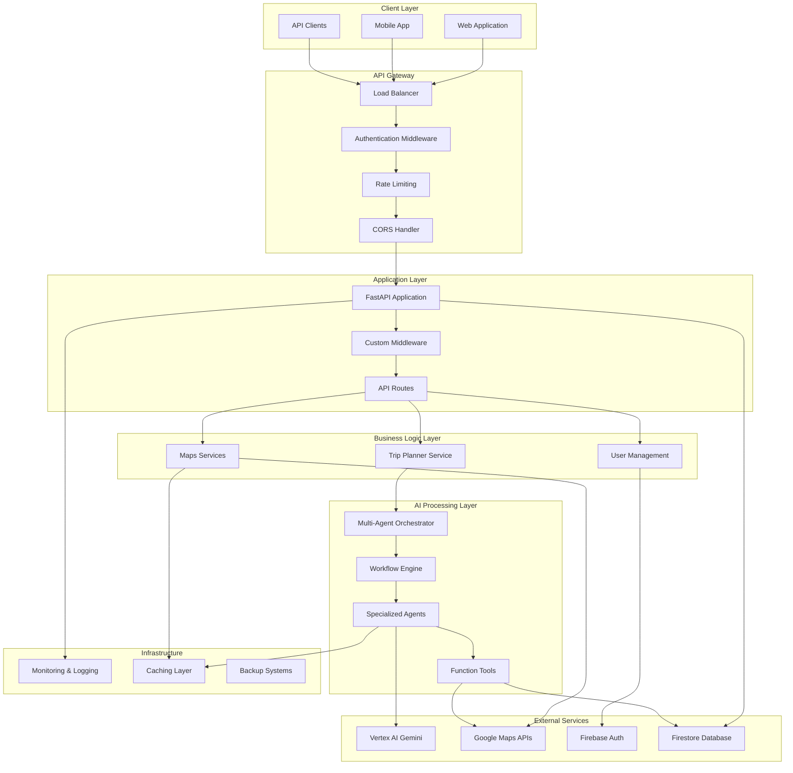
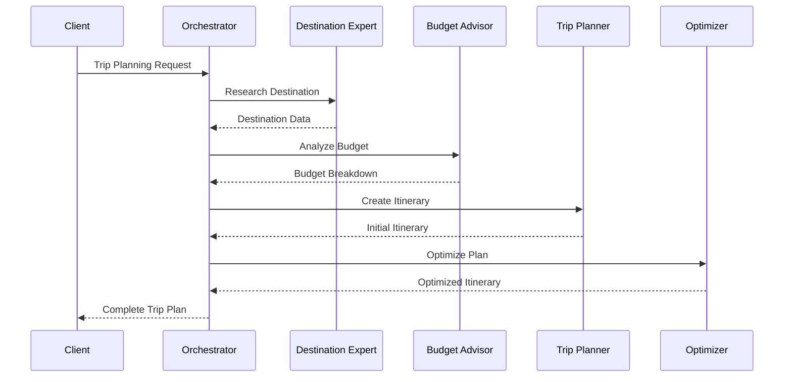
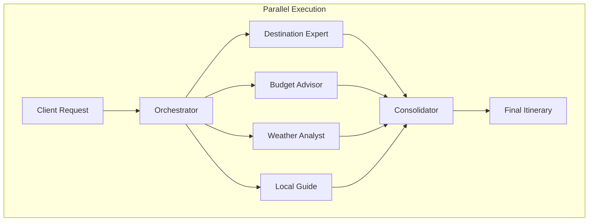
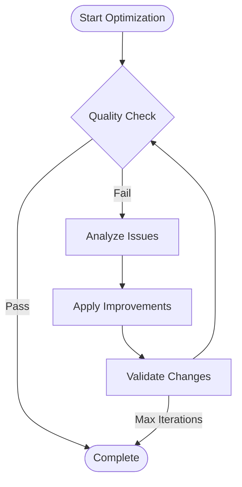
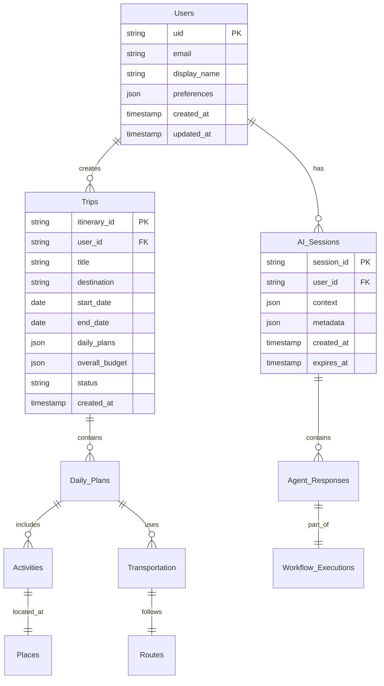
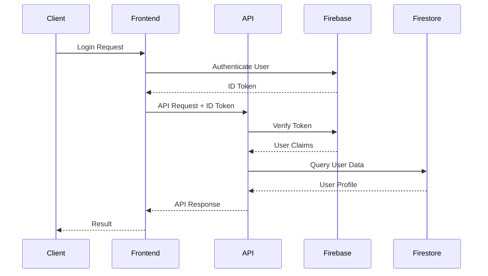
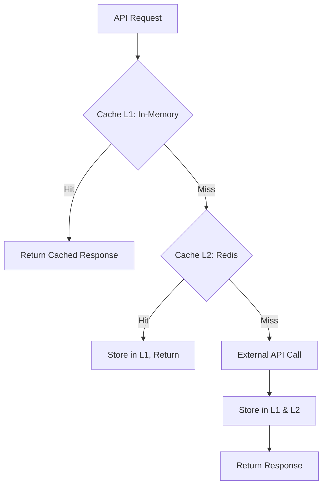
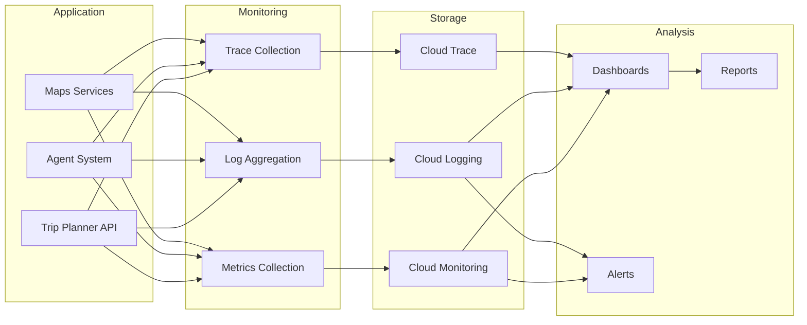
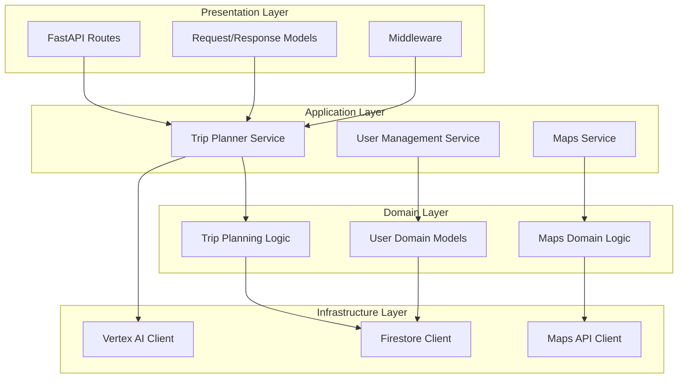
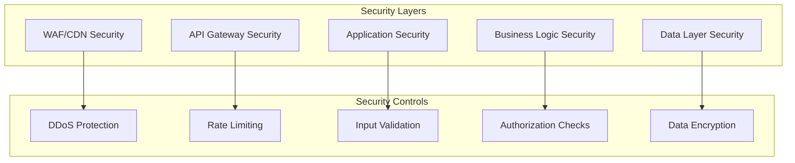

# Architecture Documentation

> Comprehensive system architecture for the AI-Powered Trip Planner Backend

## Table of Contents

- [System Overview](#system-overview)
- [Multi-Agent Architecture](#multi-agent-architecture)
- [Database Design](#database-design)
- [Security Architecture](#security-architecture)
- [API Design Patterns](#api-design-patterns)
- [Error Handling Strategy](#error-handling-strategy)
- [Performance Architecture](#performance-architecture)
- [Integration Patterns](#integration-patterns)
- [Scalability Design](#scalability-design)

---

## System Overview

### High-Level Architecture



### Core Components

| Component | Technology | Purpose | Scalability |
|-----------|------------|---------|-------------|
| **API Layer** | FastAPI + Uvicorn | REST API endpoints, OpenAPI docs | Horizontal scaling |
| **Agent Orchestrator** | Google ADK Patterns | Multi-agent workflow coordination | Auto-scaling agents |
| **AI Agents** | Vertex AI Gemini 2.0 | Specialized trip planning intelligence | Dynamic allocation |
| **Function Tools** | Custom Framework | External API integration and utilities | Pluggable architecture |
| **Authentication** | Firebase Auth | User identity and security | Global scale |
| **Database** | Firestore | Document storage and real-time sync | Auto-scaling NoSQL |
| **Maps Services** | Google Maps Platform | Location intelligence and routing | Global CDN |
| **Monitoring** | Google Cloud Logging | Observability and alerting | Real-time metrics |

### Technology Stack

#### Backend Framework
- **FastAPI**: Modern Python web framework with automatic OpenAPI generation
- **Pydantic**: Data validation and serialization with type hints
- **Uvicorn**: ASGI server for production deployment
- **Python 3.12**: Latest Python features and performance improvements

#### AI & Machine Learning
- **Google Vertex AI**: Managed ML platform for Gemini model access
- **Gemini 2.0 Flash**: Large language model for intelligent responses
- **Google ADK**: Agent Development Kit patterns for multi-agent systems
- **LangChain**: Framework for AI application development

#### Database & Storage
- **Firestore**: NoSQL document database with real-time capabilities
- **Firebase Admin SDK**: Server-side Firebase integration
- **Google Cloud Storage**: File storage for media and backups

#### External APIs
- **Google Maps Platform**: Places, Directions, Geocoding APIs
- **Firebase Authentication**: User management and security
- **Google Cloud Secret Manager**: Secure credential storage

---

## Multi-Agent Architecture

### Agent Design Patterns

The system implements Google ADK (Agent Development Kit) patterns for scalable multi-agent coordination:

#### Sequential Agent Pattern



#### Parallel Agent Pattern



#### Loop Agent Pattern



### Agent Roles and Responsibilities

#### Core Planning Agents

1. **Trip Planner Agent**
   - **Role**: Primary coordination and itinerary creation
   - **Capabilities**: Comprehensive trip planning, activity scheduling
   - **Functions**: `find_places`, `get_directions`, `get_travel_time`, `convert_currency`
   - **Output**: Structured itinerary with daily plans

2. **Destination Expert Agent**
   - **Role**: Local knowledge and cultural insights
   - **Capabilities**: Destination research, cultural recommendations
   - **Functions**: `find_places`, `find_nearby_places`, `get_place_details`
   - **Output**: Expert insights and recommendations

3. **Budget Advisor Agent**
   - **Role**: Cost optimization and financial planning
   - **Capabilities**: Budget analysis, cost breakdown, optimization
   - **Functions**: `convert_currency`, `find_places` (for pricing)
   - **Output**: Budget breakdown and cost analysis

#### Specialized Support Agents

4. **Itinerary Planner Agent**
   - **Role**: Daily scheduling and route optimization
   - **Capabilities**: Timeline coordination, logistics planning
   - **Functions**: `get_directions`, `get_travel_time`, `get_place_details`
   - **Output**: Daily itinerary with optimized timing

5. **Information Gatherer Agent**
   - **Role**: Data collection and research
   - **Capabilities**: Parallel data gathering, venue analysis
   - **Functions**: `find_places`, `geocode_location`, `validate_location`
   - **Output**: Structured research data

6. **Optimization Agent**
   - **Role**: Route and cost optimization
   - **Capabilities**: Multi-criteria optimization algorithms
   - **Functions**: `get_travel_time`, `get_directions`, `convert_currency`
   - **Output**: Optimized plans and efficiency reports

### Agent Communication Patterns

#### Handoff Pattern
```python
# Sequential coordination
class HandoffCoordination:
    async def execute(self, agents: List[BaseAgent], context: Dict[str, Any]):
        results = {}
        for agent in agents:
            # Agent processes and passes context to next
            result = await agent.process_message(message, context)
            context.update(result)
            results[agent.agent_id] = result
        return results
```

#### Collaboration Pattern
```python
# Parallel coordination
class CollaborationCoordination:
    async def execute(self, agents: List[BaseAgent], context: Dict[str, Any]):
        tasks = [agent.process_message(message, context) for agent in agents]
        results = await asyncio.gather(*tasks, return_exceptions=True)
        return self.merge_results(results)
```

#### Delegation Pattern
```python
# Hierarchical task distribution
class DelegationCoordination:
    async def execute(self, primary_agent: BaseAgent, sub_agents: List[BaseAgent]):
        # Primary agent delegates subtasks
        subtasks = await primary_agent.create_subtasks(context)
        results = await self.execute_subtasks(sub_agents, subtasks)
        return await primary_agent.consolidate_results(results)
```

### Agent Factory System

```python
# Dynamic agent creation based on trip complexity
class TripPlanningAgentFactory:
    def create_agent_team_for_trip(self, requirements: TripRequirements):
        if requirements.complexity == TripComplexity.SIMPLE:
            return [TripPlannerAgent, BudgetAdvisorAgent]
        elif requirements.complexity == TripComplexity.COMPLEX:
            return [
                InformationGathererAgent,
                DestinationExpertAgent,
                ItineraryPlannerAgent,
                BudgetAdvisorAgent,
                RoutePlannerAgent,
                OptimizationAgent
            ]
```

### Workflow Engine Architecture

```python
# Workflow execution patterns
class WorkflowExecutionEngine:
    async def execute_workflow(self, workflow_def: WorkflowDefinition):
        if workflow_def.type == WorkflowType.SEQUENTIAL:
            return await self.sequential_agent.execute(workflow_def)
        elif workflow_def.type == WorkflowType.PARALLEL:
            return await self.parallel_agent.execute(workflow_def)
        elif workflow_def.type == WorkflowType.LOOP:
            return await self.loop_agent.execute(workflow_def)
```

---

## Database Design

### Firestore Collections

#### Users Collection
```javascript
// /users/{userId}
{
  "uid": "user123",
  "email": "user@example.com",
  "email_verified": true,
  "display_name": "John Doe",
  "first_name": "John",
  "last_name": "Doe",
  "photo_url": "https://example.com/photo.jpg",
  "phone_number": "+919876543210",
  "date_of_birth": "1990-05-15",
  "gender": "male",
  "location": "Mumbai, India",
  "bio": "Travel enthusiast",
  "profile_complete": true,
  "terms_accepted": true,
  "privacy_policy_accepted": true,
  "marketing_emails_enabled": false,
  "preferences": {
    "preferred_activities": ["cultural", "nature"],
    "accommodation_types": ["hotel", "resort"],
    "transportation_modes": ["flight", "train"],
    "budget_range": "moderate",
    "dietary_restrictions": ["vegetarian"],
    "language_preferences": ["en", "hi"],
    "currency_preference": "INR",
    "time_zone": "Asia/Kolkata"
  },
  "created_at": "2024-01-15T10:30:00Z",
  "updated_at": "2024-03-10T14:20:00Z"
}
```

#### Trips Collection
```javascript
// /trips/{tripId}
{
  "itinerary_id": "itin_789123456",
  "request_id": "req_456789123",
  "user_id": "user123",
  "title": "7-Day Kerala Cultural Experience",
  "description": "A perfect blend of culture and nature",
  "destination": "Kerala, India",
  "start_date": "2024-03-15",
  "end_date": "2024-03-22",
  "duration_days": 7,
  "traveler_count": 2,
  "daily_plans": [
    {
      "day_number": 1,
      "plan_date": "2024-03-15",
      "theme": "Arrival & Kochi Exploration",
      "activities": [
        {
          "activity_id": "act_001",
          "name": "Fort Kochi Walking Tour",
          "activity_type": "cultural",
          "location": {
            "place_id": "ChIJbU60yXjnAzsR4jF4tHe_VpU",
            "name": "Fort Kochi",
            "address": {
              "formatted_address": "Fort Kochi, Kochi, Kerala, India",
              "city": "Kochi",
              "country": "India",
              "location": {
                "latitude": 9.9647,
                "longitude": 76.2397
              }
            }
          },
          "duration": 180,
          "cost": 1500.00
        }
      ],
      "transportation": [],
      "accommodation": {
        "place_id": "hotel_001",
        "name": "Heritage Hotel Kochi"
      },
      "total_cost": 8500.00
    }
  ],
  "overall_budget": {
    "total_budget": 50000.00,
    "currency": "INR",
    "breakdown": {
      "accommodation": 21000.00,
      "activities": 8500.00,
      "transportation": 15000.00,
      "meals": 5500.00
    }
  },
  "optimization_score": {
    "budget_efficiency": 0.92,
    "time_optimization": 0.88,
    "route_efficiency": 0.85
  },
  "agent_responses": [
    {
      "response_id": "resp_001",
      "agent_id": "dest_expert_kerala",
      "agent_role": "destination_expert",
      "confidence_score": 0.92
    }
  ],
  "status": "completed",
  "version": 1,
  "created_at": "2024-03-10T10:30:00Z",
  "updated_at": "2024-03-12T14:20:00Z",
  "created_by_agents": ["dest_expert_kerala", "trip_planner_001"]
}
```

#### AI Sessions Collection
```javascript
// /ai_sessions/{sessionId}
{
  "session_id": "session_123",
  "user_id": "user123",
  "context": {
    "user_profile": {
      "preferences": {},
      "trip_history": []
    },
    "trip_context": {
      "current_trip": {},
      "preferences": {}
    },
    "conversation_history": [
      {
        "role": "user",
        "content": "Plan a trip to Kerala",
        "timestamp": "2024-03-10T10:30:00Z"
      }
    ],
    "agent_states": {
      "trip_planner_001": {
        "state": "ready",
        "last_activity": "2024-03-10T10:35:00Z"
      }
    },
    "workflow_executions": {
      "exec_001": {
        "state": "completed",
        "results": {}
      }
    }
  },
  "metadata": {
    "user_agent": "Mozilla/5.0...",
    "ip_address": "192.168.1.1",
    "session_duration": 1800
  },
  "created_at": "2024-03-10T10:30:00Z",
  "last_activity": "2024-03-10T12:00:00Z",
  "expires_at": "2024-03-11T10:30:00Z"
}
```

### Data Relationships



### Database Indexes

#### Performance Indexes
```javascript
// Composite indexes for efficient queries
{
  "users": [
    ["uid", "created_at"],
    ["email", "email_verified"]
  ],
  "trips": [
    ["user_id", "status", "created_at"],
    ["user_id", "destination", "start_date"],
    ["destination", "start_date"],
    ["status", "created_at"]
  ],
  "ai_sessions": [
    ["user_id", "created_at"],
    ["user_id", "expires_at"],
    ["session_id", "last_activity"]
  ]
}
```

### Data Access Patterns

#### Repository Pattern Implementation

```python
class TripRepository:
    def __init__(self, firestore_client: FirestoreClient):
        self.db = firestore_client
        self.collection = "trips"
    
    async def create_trip(self, trip: TripItinerary) -> str:
        trip_data = trip.model_dump(exclude_none=True)
        return await self.db.create_document(self.collection, trip_data)
    
    async def get_user_trips(
        self, 
        user_id: str, 
        filters: Dict[str, Any] = None,
        pagination: Dict[str, Any] = None
    ) -> List[TripItinerary]:
        query_filters = [("user_id", "==", user_id)]
        if filters:
            query_filters.extend(self._build_filters(filters))
        
        docs = await self.db.query_documents(
            self.collection,
            filters=query_filters,
            **pagination
        )
        
        return [TripItinerary.model_validate(doc) for doc in docs]
```

---

## Security Architecture

### Authentication Flow



### Security Layers

#### 1. Authentication Layer
```python
# Firebase token verification
async def verify_firebase_token(token: str) -> Dict[str, Any]:
    try:
        decoded_token = auth.verify_id_token(token)
        return {
            "uid": decoded_token["uid"],
            "email": decoded_token.get("email"),
            "email_verified": decoded_token.get("email_verified", False)
        }
    except Exception as e:
        raise AuthenticationError(f"Token verification failed: {e}")
```

#### 2. Authorization Layer
```python
# Role-based access control
class AuthorizationMiddleware:
    async def __call__(self, request: Request, call_next):
        user_context = request.state.user_context
        
        # Check resource ownership for trip operations
        if request.url.path.startswith("/api/v1/trips/"):
            trip_id = self.extract_trip_id(request.url.path)
            if trip_id and not await self.can_access_trip(user_context["uid"], trip_id):
                raise HTTPException(403, "Access denied")
        
        return await call_next(request)
```

#### 3. Data Protection Layer
```python
# Data encryption and sanitization
class DataProtectionService:
    def encrypt_sensitive_data(self, data: Dict[str, Any]) -> Dict[str, Any]:
        sensitive_fields = ["phone_number", "payment_info"]
        encrypted_data = data.copy()
        
        for field in sensitive_fields:
            if field in encrypted_data:
                encrypted_data[field] = self.encrypt(encrypted_data[field])
        
        return encrypted_data
    
    def sanitize_logs(self, log_data: Dict[str, Any]) -> Dict[str, Any]:
        # Remove sensitive information from logs
        sanitized = log_data.copy()
        for key in ["api_key", "token", "password"]:
            if key in sanitized:
                sanitized[key] = "***masked***"
        return sanitized
```

### Firestore Security Rules

```javascript
// firestore.rules
rules_version = '2';
service cloud.firestore {
  match /databases/{database}/documents {
    // Users can only access their own data
    match /users/{userId} {
      allow read, write: if request.auth != null && request.auth.uid == userId;
      
      // Allow profile updates with validation
      allow update: if request.auth != null 
        && request.auth.uid == userId
        && isValidProfileUpdate(request.resource.data);
    }
    
    // Trip access control
    match /trips/{tripId} {
      allow read: if request.auth != null && 
        (request.auth.uid == resource.data.user_id || 
         request.auth.uid in resource.data.get('shared_with', []));
      
      allow write: if request.auth != null && 
        request.auth.uid == resource.data.user_id;
      
      allow create: if request.auth != null && 
        request.auth.uid == request.resource.data.user_id;
    }
    
    // AI sessions - user-specific access
    match /ai_sessions/{sessionId} {
      allow read, write: if request.auth != null && 
        request.auth.uid == resource.data.user_id;
    }
    
    // Places cache - read-only for authenticated users
    match /places_cache/{placeId} {
      allow read: if request.auth != null;
      allow write: if false; // Only server can write
    }
  }
  
  // Validation functions
  function isValidProfileUpdate(data) {
    return data.keys().hasAll(['updated_at']) &&
           data.updated_at is timestamp;
  }
}
```

### API Security Configuration

```python
# Security middleware configuration
app.add_middleware(
    CORSMiddleware,
    allow_origins=settings.allowed_origins,
    allow_credentials=True,
    allow_methods=settings.allowed_methods,
    allow_headers=settings.allowed_headers,
)

# Rate limiting
from slowapi import Limiter
limiter = Limiter(key_func=get_remote_address)

@app.middleware("http")
async def rate_limit_middleware(request: Request, call_next):
    # Apply different limits based on endpoint
    if request.url.path.startswith("/api/v1/trips/plan"):
        await limiter.check("5/minute")(request)
    elif request.url.path.startswith("/api/v1/places"):
        await limiter.check("100/hour")(request)
    
    return await call_next(request)
```

---

## API Design Patterns

### RESTful Resource Design

#### Resource Naming Convention
```
/api/v1/trips                    # Trip collection
/api/v1/trips/{id}              # Specific trip
/api/v1/trips/{id}/share        # Trip action
/api/v1/trips/{id}/metrics      # Trip metrics
/api/v1/users/profile           # User profile
/api/v1/users/preferences       # User preferences
/api/v1/places/search           # Places search
/api/v1/places/{id}             # Specific place
```

#### HTTP Method Usage
| Method | Usage | Idempotent | Safe |
|--------|-------|------------|------|
| GET | Retrieve resources | ✅ | ✅ |
| POST | Create resources, actions | ❌ | ❌ |
| PUT | Update entire resource | ✅ | ❌ |
| PATCH | Partial resource update | ❌ | ❌ |
| DELETE | Remove resource | ✅ | ❌ |

### Response Design Patterns

#### Standard Response Envelope
```python
class ApiResponse(BaseModel):
    success: bool
    data: Optional[Any] = None
    message: str
    timestamp: datetime = Field(default_factory=datetime.now)
    request_id: Optional[str] = None

# Success response
{
  "success": true,
  "data": {...},
  "message": "Operation completed successfully",
  "timestamp": "2024-03-12T12:00:00Z",
  "request_id": "req_123456"
}

# Error response
{
  "success": false,
  "error": {
    "code": "VALIDATION_ERROR",
    "message": "Invalid request parameters",
    "details": {...}
  },
  "timestamp": "2024-03-12T12:00:00Z",
  "request_id": "req_123456"
}
```

#### Pagination Pattern
```python
class PaginatedResponse(BaseModel):
    success: bool
    data: List[Any]
    pagination: PaginationInfo
    
class PaginationInfo(BaseModel):
    page: int
    limit: int
    total: Optional[int] = None
    has_next_page: bool
    has_previous_page: bool
```

### Dependency Injection Pattern

```python
# Centralized dependency management
async def get_user_context(
    token: str = Depends(get_auth_token),
    db: FirestoreClient = Depends(get_database_client)
) -> Dict[str, Any]:
    user_data = await verify_token(token)
    profile = await db.get_document("users", user_data["uid"])
    
    return {
        "user_id": user_data["uid"],
        "email": user_data["email"],
        "profile": profile,
        "auth_user": user_data
    }

# Usage in routes
@router.post("/trips/plan")
async def create_trip_plan(
    request: TripPlanRequest,
    user_context: Dict[str, Any] = Depends(get_user_context),
    service: TripPlannerService = Depends(get_trip_planner_service)
):
    return await service.create_trip_plan(user_context["user_id"], request)
```

### Async Processing Pattern

```python
# Background task processing
@router.post("/trips/plan")
async def create_trip_plan(
    request: TripPlanRequest,
    background_tasks: BackgroundTasks,
    background: bool = Query(False)
):
    if background:
        # Queue for background processing
        task_id = str(uuid4())
        background_tasks.add_task(
            process_trip_plan_async,
            task_id,
            request
        )
        return {"task_id": task_id, "status": "queued"}
    else:
        # Synchronous processing
        return await process_trip_plan_sync(request)
```

---

## Error Handling Strategy

### Exception Hierarchy

```python
# Custom exception hierarchy
class TripPlannerBaseException(Exception):
    """Base exception for all trip planner errors."""
    
    def __init__(self, message: str, details: Dict[str, Any] = None):
        self.message = message
        self.details = details or {}
        super().__init__(message)

class BusinessLogicException(TripPlannerBaseException):
    """Business logic errors."""
    pass

class ExternalServiceException(TripPlannerBaseException):
    """External service integration errors."""
    
    def __init__(self, service_name: str, message: str, details: Dict[str, Any] = None):
        self.service_name = service_name
        super().__init__(message, details)

class AgentError(BusinessLogicException):
    """AI agent execution errors."""
    
    def __init__(self, message: str, agent_id: str = None, details: Dict[str, Any] = None):
        self.agent_id = agent_id
        super().__init__(message, details)

class DatabaseException(ExternalServiceException):
    """Database operation errors."""
    
    def __init__(self, message: str, details: Dict[str, Any] = None):
        super().__init__("firestore", message, details)
```

### Global Exception Handler

```python
@app.exception_handler(TripPlannerBaseException)
async def trip_planner_exception_handler(request: Request, exc: TripPlannerBaseException):
    return JSONResponse(
        status_code=400,
        content={
            "success": false,
            "error": {
                "code": exc.__class__.__name__,
                "message": exc.message,
                "details": exc.details
            },
            "timestamp": datetime.now().isoformat(),
            "request_id": getattr(request.state, "request_id", None)
        }
    )

@app.exception_handler(ExternalServiceException)
async def external_service_exception_handler(request: Request, exc: ExternalServiceException):
    return JSONResponse(
        status_code=502,
        content={
            "success": false,
            "error": {
                "code": "EXTERNAL_SERVICE_ERROR",
                "message": f"{exc.service_name} service error: {exc.message}",
                "service": exc.service_name,
                "details": exc.details
            },
            "timestamp": datetime.now().isoformat()
        }
    )
```

### Logging Strategy

#### Structured Logging Configuration

```python
import structlog
from google.cloud import logging as cloud_logging

# Configure structured logging
structlog.configure(
    processors=[
        structlog.stdlib.filter_by_level,
        structlog.processors.TimeStamper(fmt="iso"),
        structlog.dev.ConsoleRenderer()
        if settings.debug
        else structlog.processors.JSONRenderer(),
    ],
    wrapper_class=structlog.stdlib.BoundLogger,
    logger_factory=structlog.stdlib.LoggerFactory(),
    context_class=dict,
    cache_logger_on_first_use=True,
)

# Usage
logger = structlog.get_logger(__name__)

logger.info(
    "Trip generation started",
    user_id="user123",
    destination="Kerala",
    duration_days=7,
    workflow_type="comprehensive",
    request_id="req_456789"
)
```

#### Correlation ID Tracking

```python
@app.middleware("http")
async def correlation_id_middleware(request: Request, call_next):
    correlation_id = request.headers.get("X-Correlation-ID", str(uuid4()))
    request.state.correlation_id = correlation_id
    
    # Add to logging context
    with structlog.contextvars.bound_contextvars(correlation_id=correlation_id):
        response = await call_next(request)
        response.headers["X-Correlation-ID"] = correlation_id
        return response
```

### Error Recovery Patterns

#### Circuit Breaker Pattern
```python
class CircuitBreaker:
    def __init__(self, failure_threshold: int = 5, timeout: int = 60):
        self.failure_threshold = failure_threshold
        self.timeout = timeout
        self.failure_count = 0
        self.last_failure_time = None
        self.state = "CLOSED"  # CLOSED, OPEN, HALF_OPEN
    
    async def call(self, func: Callable, *args, **kwargs):
        if self.state == "OPEN":
            if (datetime.now() - self.last_failure_time).seconds > self.timeout:
                self.state = "HALF_OPEN"
            else:
                raise ServiceUnavailableError("Circuit breaker is OPEN")
        
        try:
            result = await func(*args, **kwargs)
            self.on_success()
            return result
        except Exception as e:
            self.on_failure()
            raise e
    
    def on_success(self):
        self.failure_count = 0
        self.state = "CLOSED"
    
    def on_failure(self):
        self.failure_count += 1
        self.last_failure_time = datetime.now()
        
        if self.failure_count >= self.failure_threshold:
            self.state = "OPEN"
```

#### Retry Pattern with Exponential Backoff
```python
async def retry_with_backoff(
    func: Callable,
    max_retries: int = 3,
    base_delay: float = 1.0,
    max_delay: float = 60.0,
    backoff_factor: float = 2.0
):
    for attempt in range(max_retries):
        try:
            return await func()
        except Exception as e:
            if attempt == max_retries - 1:
                raise e
            
            delay = min(base_delay * (backoff_factor ** attempt), max_delay)
            await asyncio.sleep(delay)
            
            logger.warning(
                "Retrying after failure",
                attempt=attempt + 1,
                delay=delay,
                error=str(e)
            )
```

---

## Performance Architecture

### Caching Strategy

#### Multi-Level Caching



#### Implementation

```python
from functools import wraps
import redis.asyncio as redis

class CacheManager:
    def __init__(self):
        self.memory_cache = {}  # L1 Cache
        self.redis_client = redis.from_url(settings.redis_url)  # L2 Cache
    
    async def get(self, key: str) -> Any:
        # Try L1 cache first
        if key in self.memory_cache:
            value, expiry = self.memory_cache[key]
            if datetime.now() < expiry:
                return value
            else:
                del self.memory_cache[key]
        
        # Try L2 cache
        value = await self.redis_client.get(key)
        if value:
            # Store in L1 cache
            self.memory_cache[key] = (value, datetime.now() + timedelta(minutes=5))
            return value
        
        return None
    
    async def set(self, key: str, value: Any, ttl: int = 3600):
        # Store in both caches
        expiry = datetime.now() + timedelta(seconds=ttl)
        self.memory_cache[key] = (value, expiry)
        await self.redis_client.setex(key, ttl, value)

# Cache decorator
def cached(ttl: int = 3600):
    def decorator(func):
        @wraps(func)
        async def wrapper(*args, **kwargs):
            cache_key = f"{func.__name__}:{hash(str(args) + str(kwargs))}"
            cached_result = await cache_manager.get(cache_key)
            
            if cached_result:
                return cached_result
            
            result = await func(*args, **kwargs)
            await cache_manager.set(cache_key, result, ttl)
            return result
        return wrapper
    return decorator
```

### Database Optimization

#### Query Optimization Patterns

```python
# Efficient pagination
async def get_user_trips_paginated(
    user_id: str,
    page_size: int = 10,
    cursor: str = None
) -> Dict[str, Any]:
    query = firestore_client.collection("trips").where("user_id", "==", user_id)
    
    if cursor:
        # Use cursor-based pagination for large datasets
        cursor_doc = await firestore_client.document(cursor).get()
        query = query.start_after(cursor_doc)
    
    query = query.limit(page_size + 1)  # Get one extra for next page check
    
    docs = await query.get()
    trips = [doc.to_dict() for doc in docs[:page_size]]
    
    has_next = len(docs) > page_size
    next_cursor = docs[page_size - 1].reference.path if has_next else None
    
    return {
        "trips": trips,
        "has_next_page": has_next,
        "next_cursor": next_cursor
    }
```

#### Batch Operations

```python
# Efficient batch operations
async def create_multiple_trips(trips: List[TripItinerary]) -> List[str]:
    batch = firestore_client.batch()
    trip_ids = []
    
    for trip in trips:
        trip_id = str(uuid4())
        trip_ids.append(trip_id)
        
        doc_ref = firestore_client.collection("trips").document(trip_id)
        batch.set(doc_ref, trip.model_dump())
    
    await batch.commit()
    return trip_ids
```

### AI Processing Optimization

#### Agent Pool Management

```python
class AgentPoolManager:
    def __init__(self):
        self.agent_pools = {role: [] for role in AgentRole}
        self.pool_sizes = {role: 3 for role in AgentRole}  # Default pool size
    
    async def get_agent(self, role: AgentRole, session_id: str) -> BaseAgent:
        pool = self.agent_pools[role]
        
        # Get available agent from pool
        for agent in pool:
            if agent.state == AgentState.READY:
                return agent
        
        # Create new agent if pool not full
        if len(pool) < self.pool_sizes[role]:
            agent = await self.create_agent(role, session_id)
            pool.append(agent)
            return agent
        
        # Wait for agent to become available
        return await self.wait_for_available_agent(role)
```

#### Token Usage Optimization

```python
class TokenManager:
    def __init__(self):
        self.token_budgets = {
            "user_session": 10000,  # tokens per session
            "user_hour": 50000,     # tokens per hour
            "global_hour": 1000000  # global rate limit
        }
        self.usage_tracking = {}
    
    async def check_token_budget(self, user_id: str, estimated_tokens: int) -> bool:
        current_usage = await self.get_user_token_usage(user_id)
        
        # Check various limits
        if current_usage["session"] + estimated_tokens > self.token_budgets["user_session"]:
            return False
        
        if current_usage["hour"] + estimated_tokens > self.token_budgets["user_hour"]:
            return False
        
        return True
    
    async def record_token_usage(self, user_id: str, tokens_used: int):
        # Update usage tracking
        await self.update_usage_metrics(user_id, tokens_used)
```

---

## Integration Patterns

### External Service Integration

#### Google Maps API Integration

```python
class MapsServiceClient:
    def __init__(self):
        self.client = googlemaps.Client(key=settings.google_maps_api_key)
        self.cache = CacheManager()
        self.rate_limiter = RateLimiter(requests_per_second=10)
    
    async def search_places(self, query: str, location: GeoLocation) -> List[Place]:
        cache_key = f"places:{query}:{location}"
        cached_result = await self.cache.get(cache_key)
        
        if cached_result:
            return cached_result
        
        # Rate limiting
        await self.rate_limiter.acquire()
        
        try:
            # API call with circuit breaker
            result = await self.circuit_breaker.call(
                self._search_places_api,
                query,
                location
            )
            
            # Cache successful results
            await self.cache.set(cache_key, result, ttl=1800)  # 30 minutes
            return result
            
        except Exception as e:
            logger.error("Maps API call failed", error=str(e))
            raise ExternalServiceException("google_maps", str(e))
```

#### Vertex AI Integration

```python
class VertexAIClient:
    def __init__(self):
        self.project_id = settings.vertex_ai_project_id
        self.region = settings.vertex_ai_region
        self.model_name = settings.gemini_model
        self.client = None
    
    async def generate_content(
        self, 
        prompt: str, 
        context: Dict[str, Any] = None
    ) -> str:
        try:
            # Prepare generation config
            generation_config = {
                "temperature": settings.gemini_temperature,
                "max_output_tokens": settings.gemini_max_tokens,
                "top_p": settings.gemini_top_p,
                "top_k": settings.gemini_top_k
            }
            
            # Add safety settings
            safety_settings = [
                {"category": "HARM_CATEGORY_HARASSMENT", "threshold": "BLOCK_MEDIUM_AND_ABOVE"},
                {"category": "HARM_CATEGORY_HATE_SPEECH", "threshold": "BLOCK_MEDIUM_AND_ABOVE"},
                {"category": "HARM_CATEGORY_SEXUALLY_EXPLICIT", "threshold": "BLOCK_MEDIUM_AND_ABOVE"},
                {"category": "HARM_CATEGORY_DANGEROUS_CONTENT", "threshold": "BLOCK_MEDIUM_AND_ABOVE"}
            ]
            
            # Generate content
            response = await self.client.generate_content_async(
                prompt,
                generation_config=generation_config,
                safety_settings=safety_settings
            )
            
            return response.text
            
        except Exception as e:
            logger.error("Vertex AI generation failed", error=str(e))
            raise ExternalServiceException("vertex_ai", str(e))
```

### Message Queue Integration

```python
# Event-driven architecture for async processing
class EventBus:
    def __init__(self):
        self.subscribers = {}
        self.event_history = []
    
    def subscribe(self, event_type: str, handler: Callable):
        if event_type not in self.subscribers:
            self.subscribers[event_type] = []
        self.subscribers[event_type].append(handler)
    
    async def publish(self, event_type: str, data: Dict[str, Any]):
        event = {
            "event_id": str(uuid4()),
            "event_type": event_type,
            "data": data,
            "timestamp": datetime.now().isoformat()
        }
        
        self.event_history.append(event)
        
        # Notify subscribers
        handlers = self.subscribers.get(event_type, [])
        tasks = [handler(event) for handler in handlers]
        await asyncio.gather(*tasks, return_exceptions=True)

# Usage
event_bus = EventBus()

# Subscribe to events
@event_bus.subscribe("trip.created")
async def send_trip_notification(event):
    user_id = event["data"]["user_id"]
    trip_id = event["data"]["trip_id"]
    await notification_service.send_trip_ready_notification(user_id, trip_id)

# Publish events
await event_bus.publish("trip.created", {
    "user_id": "user123",
    "trip_id": "trip456"
})
```

---

## Scalability Design

### Horizontal Scaling Strategy

#### Stateless Application Design

```python
# Stateless service design
class TripPlannerService:
    def __init__(self, db: FirestoreClient, orchestrator_factory: Callable):
        self.db = db
        self.orchestrator_factory = orchestrator_factory
        # No instance state stored
    
    async def create_trip_plan(self, user_id: str, request: TripRequest):
        # Create fresh orchestrator for each request
        orchestrator = self.orchestrator_factory(f"session_{user_id}_{int(time.time())}")
        
        # Process request
        result = await orchestrator.execute_workflow(...)
        
        # Store result in database
        await self.db.create_document("trips", result.model_dump())
        
        return result
```

#### Load Balancing Configuration

```yaml
# Load balancer configuration for multiple instances
upstream trip_planner_backend {
    least_conn;  # Route to least connected server
    
    server backend1.example.com:8000 weight=3;
    server backend2.example.com:8000 weight=3;
    server backend3.example.com:8000 weight=2;
    
    # Health checks
    check interval=30s;
    check_http_send "GET /health HTTP/1.0\r\n\r\n";
    check_http_expect_alive http_2xx http_3xx;
}
```

### Vertical Scaling Optimization

#### Resource Allocation
```python
# Adaptive resource allocation based on workload
class ResourceManager:
    def __init__(self):
        self.current_load = 0
        self.max_agents = 50
        self.min_agents = 5
    
    async def scale_agents(self, load_factor: float):
        optimal_agents = max(
            self.min_agents,
            min(self.max_agents, int(load_factor * 20))
        )
        
        current_agents = len(self.active_agents)
        
        if optimal_agents > current_agents:
            # Scale up
            for _ in range(optimal_agents - current_agents):
                await self.create_agent()
        elif optimal_agents < current_agents:
            # Scale down
            for _ in range(current_agents - optimal_agents):
                await self.terminate_idle_agent()
```

### Database Scaling Patterns

#### Read Replica Strategy
```python
# Read/write splitting for database operations
class DatabaseRouter:
    def __init__(self):
        self.write_client = FirestoreClient(settings.primary_db_config)
        self.read_clients = [
            FirestoreClient(config) for config in settings.read_replica_configs
        ]
        self.read_index = 0
    
    async def read_operation(self, operation: Callable):
        # Round-robin read replica selection
        client = self.read_clients[self.read_index % len(self.read_clients)]
        self.read_index += 1
        return await operation(client)
    
    async def write_operation(self, operation: Callable):
        # Always use primary for writes
        return await operation(self.write_client)
```

### Auto-Scaling Configuration

#### Kubernetes HPA

```yaml
apiVersion: autoscaling/v2
kind: HorizontalPodAutoscaler
metadata:
  name: trip-planner-hpa
spec:
  scaleTargetRef:
    apiVersion: apps/v1
    kind: Deployment
    name: trip-planner
  minReplicas: 3
  maxReplicas: 50
  metrics:
  - type: Resource
    resource:
      name: cpu
      target:
        type: Utilization
        averageUtilization: 70
  - type: Resource
    resource:
      name: memory
      target:
        type: Utilization
        averageUtilization: 80
  - type: Pods
    pods:
      metric:
        name: active_requests_per_pod
      target:
        type: AverageValue
        averageValue: "100"
  behavior:
    scaleUp:
      stabilizationWindowSeconds: 60
      policies:
      - type: Pods
        value: 2
        periodSeconds: 60
    scaleDown:
      stabilizationWindowSeconds: 300
      policies:
      - type: Pods
        value: 1
        periodSeconds: 60
```

#### Cloud Run Auto-Scaling

```yaml
apiVersion: serving.knative.dev/v1
kind: Service
metadata:
  name: trip-planner
  annotations:
    autoscaling.knative.dev/minScale: "3"
    autoscaling.knative.dev/maxScale: "100"
    autoscaling.knative.dev/target: "70"
    run.googleapis.com/cpu-throttling: "false"
spec:
  template:
    metadata:
      annotations:
        autoscaling.knative.dev/targetUtilizationPercentage: "70"
        run.googleapis.com/memory: "4Gi"
        run.googleapis.com/cpu: "2"
    spec:
      containerConcurrency: 100
      timeoutSeconds: 300
```

---

## Monitoring Architecture

### Observability Stack



### Custom Metrics

```python
# Application-specific metrics
from prometheus_client import Counter, Histogram, Gauge, Info

# Business metrics
TRIP_GENERATIONS = Counter(
    'trip_generations_total',
    'Total trip generations',
    ['user_tier', 'destination_country', 'trip_complexity']
)

TRIP_GENERATION_DURATION = Histogram(
    'trip_generation_duration_seconds',
    'Time spent generating trip plans',
    ['workflow_type', 'agent_count']
)

ACTIVE_AI_SESSIONS = Gauge(
    'active_ai_sessions',
    'Number of active AI sessions'
)

AGENT_PERFORMANCE = Histogram(
    'agent_execution_duration_seconds',
    'Agent execution time',
    ['agent_role', 'complexity_level']
)

# Technical metrics
API_REQUEST_DURATION = Histogram(
    'api_request_duration_seconds',
    'API request duration',
    ['method', 'endpoint', 'status_code']
)

EXTERNAL_API_CALLS = Counter(
    'external_api_calls_total',
    'External API calls',
    ['service', 'endpoint', 'status']
)

DATABASE_OPERATIONS = Histogram(
    'database_operation_duration_seconds',
    'Database operation duration',
    ['operation', 'collection']
)
```

### Health Check Architecture

```python
class HealthCheckManager:
    def __init__(self):
        self.checks = {}
        self.register_default_checks()
    
    def register_check(self, name: str, check_func: Callable):
        self.checks[name] = check_func
    
    async def run_all_checks(self) -> Dict[str, Any]:
        results = {}
        overall_status = "healthy"
        
        for name, check_func in self.checks.items():
            try:
                result = await asyncio.wait_for(check_func(), timeout=10)
                results[name] = result
                
                if result.get("status") != "healthy":
                    overall_status = "degraded"
                    
            except Exception as e:
                results[name] = {"status": "unhealthy", "error": str(e)}
                overall_status = "unhealthy"
        
        return {
            "overall_status": overall_status,
            "checks": results,
            "timestamp": datetime.now().isoformat()
        }
    
    def register_default_checks(self):
        self.register_check("database", self.check_database)
        self.register_check("vertex_ai", self.check_vertex_ai)
        self.register_check("maps_api", self.check_maps_api)
        self.register_check("firebase", self.check_firebase)
    
    async def check_database(self) -> Dict[str, Any]:
        try:
            client = get_firestore_client()
            healthy = await client.health_check()
            return {"status": "healthy" if healthy else "unhealthy"}
        except Exception as e:
            return {"status": "unhealthy", "error": str(e)}
```

---

## Design Principles

### SOLID Principles Implementation

#### Single Responsibility Principle
```python
# Each service has a single responsibility
class TripPlannerService:
    """Handles only trip planning business logic"""
    
class UserManagementService:
    """Handles only user-related operations"""
    
class MapsIntegrationService:
    """Handles only Maps API integration"""
```

#### Open/Closed Principle
```python
# Extensible through interfaces
class BaseAgent(ABC):
    @abstractmethod
    async def process_message(self, message: str) -> str:
        pass

# New agents extend base without modifying existing code
class WeatherAgent(BaseAgent):
    async def process_message(self, message: str) -> str:
        # Weather-specific processing
        pass
```

#### Dependency Inversion Principle
```python
# High-level modules depend on abstractions
class TripPlannerService:
    def __init__(
        self,
        db_client: DatabaseClientInterface,
        ai_orchestrator: OrchestratorInterface,
        maps_service: MapsServiceInterface
    ):
        self.db = db_client
        self.orchestrator = ai_orchestrator
        self.maps = maps_service
```

### Clean Architecture Layers



### Event-Driven Architecture

```python
# Domain events for loose coupling
class DomainEvent(BaseModel):
    event_id: str = Field(default_factory=lambda: str(uuid4()))
    event_type: str
    aggregate_id: str
    data: Dict[str, Any]
    timestamp: datetime = Field(default_factory=datetime.now)
    version: int = 1

class TripCreatedEvent(DomainEvent):
    event_type: str = "trip.created"

class EventStore:
    async def publish(self, event: DomainEvent):
        # Store event
        await self.store_event(event)
        
        # Notify subscribers
        await self.notify_subscribers(event)
    
    async def notify_subscribers(self, event: DomainEvent):
        handlers = self.get_handlers(event.event_type)
        tasks = [handler(event) for handler in handlers]
        await asyncio.gather(*tasks, return_exceptions=True)

# Event handlers
@event_handler("trip.created")
async def send_trip_confirmation(event: TripCreatedEvent):
    user_id = event.data["user_id"]
    trip_id = event.aggregate_id
    await notification_service.send_confirmation(user_id, trip_id)

@event_handler("trip.created")
async def update_user_stats(event: TripCreatedEvent):
    user_id = event.data["user_id"]
    await analytics_service.increment_trip_count(user_id)
```

---

## Security Architecture Patterns

### Defense in Depth



### Zero Trust Implementation

```python
# Every request is verified regardless of source
class ZeroTrustMiddleware:
    async def __call__(self, request: Request, call_next):
        # 1. Verify authentication token
        token = await self.extract_token(request)
        if not token:
            raise UnauthorizedError("Authentication required")
        
        # 2. Verify token validity
        user_claims = await self.verify_token(token)
        
        # 3. Check user permissions for specific resource
        if not await self.check_permissions(user_claims, request):
            raise ForbiddenError("Insufficient permissions")
        
        # 4. Validate request integrity
        if not await self.validate_request_integrity(request):
            raise BadRequestError("Request validation failed")
        
        # 5. Log security event
        await self.log_security_event(user_claims, request)
        
        return await call_next(request)
```

### Data Privacy Architecture

```python
# GDPR-compliant data handling
class DataPrivacyManager:
    def __init__(self):
        self.encryption_service = EncryptionService()
        self.audit_logger = AuditLogger()
    
    async def store_user_data(self, user_data: Dict[str, Any]) -> str:
        # Classify data sensitivity
        sensitive_fields = self.classify_sensitive_fields(user_data)
        
        # Encrypt sensitive data
        encrypted_data = await self.encryption_service.encrypt_fields(
            user_data, sensitive_fields
        )
        
        # Log data processing
        await self.audit_logger.log_data_processing(
            action="store",
            data_types=list(user_data.keys()),
            user_consent=True
        )
        
        return await self.database.store(encrypted_data)
    
    async def delete_user_data(self, user_id: str) -> bool:
        # Complete data deletion (right to be forgotten)
        collections = ["users", "trips", "ai_sessions", "user_analytics"]
        
        for collection in collections:
            await self.database.delete_user_documents(collection, user_id)
        
        # Log deletion
        await self.audit_logger.log_data_deletion(user_id)
        
        return True
```

---

This architecture documentation provides a comprehensive overview of the AI-Powered Trip Planner Backend system design, focusing on scalability, security, and maintainability. The multi-agent architecture with Google ADK patterns enables sophisticated trip planning capabilities while maintaining clean separation of concerns and robust error handling.

For implementation details of specific components, refer to the respective service documentation and codebase.